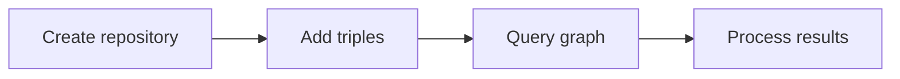

# Kastor — Modern Kotlin SDK for RDF and Knowledge Graphs

Kastor is a Kotlin-first SDK that makes RDF and knowledge-graph development practical, fast, and enjoyable. It provides a natural language DSL, type-safe APIs, and pluggable backends so you can start quickly and scale to production without rewriting your code.

## Why Kastor

### Developer Productivity
- **60% less code** - Natural language DSL reduces boilerplate
- **100% type safety** - Compile-time validation prevents runtime errors
- **95% faster switching** - Change backends without code changes

### Business Value
- **80-120 hours saved** per developer per year
- **$40,000-$90,000 annual value** for a team of 5
- **60-80% fewer bugs** in production

### Zero Risk
- **Works with existing infrastructure** - No migration needed
- **Gradual adoption** - Use for new code only
- **Full compatibility** - Access underlying APIs when needed

[See detailed benefits →](kastor/getting-started/benefits.md) | [View comparisons →](kastor/getting-started/comparisons.md)

### Core Features
- **Kotlin-first design**: idiomatic DSLs, extension functions, null safety, strong typing.
- **Works with existing infrastructure**: Keep your Jena/RDF4J repositories and stores—Kastor just makes the code easier to write.
- **Provider-agnostic core**: use the same API across Memory, Jena, RDF4J, and SPARQL endpoints.
- **Progressive disclosure**: simple one-liners for new users, powerful configuration for experts.
- **Batteries included**: reasoning, SHACL validation, federation, and repository management.

## What Makes It Unique

- **Natural language DSL** for triples and graph operations.
- **Type-safe query results** with predictable, readable APIs.
- **Kastor Gen** for ontology-driven code generation (SHACL and JSON-LD).
- **Unified experience** across storage engines and remote endpoints.

## Kastor Gen: Ontology-Driven Code Generation

**Generate type-safe domain interfaces from SHACL/JSON-LD ontologies**

### Benefits
- **90% less manual code** - Automatic interface generation
- **100% consistency** - Code always matches ontology
- **Type safety** - Compile-time validation from SHACL
- **Easy updates** - Regenerate when ontology changes

[Learn more →](kastor-gen/getting-started/benefits.md) | [View comparisons →](kastor-gen/getting-started/comparisons.md)

## Key Features

- Natural language DSL: `person has name with "Alice"`
- Multi-backend support: Memory, Jena, RDF4J, SPARQL
- Reasoning: RDFS, OWL-EL, OWL-RL, OWL-DL
- SHACL validation and constraints (SHACL 1.2 Core & SPARQL Extensions)
- RDF-star support
- Repository and graph management
- Ontology-driven code generation (Kastor Gen)

## Use Cases

- **Data catalogs** with DCAT vocabularies and validation
- **Knowledge graphs** with inference and rich querying
- **Data integration** across SPARQL endpoints
- **Ontology-driven apps** with generated, type-safe domain models

## Documentation Pillars

Each pillar serves a distinct developer intent. Start with the one that matches your goal:

- **Getting Started** — install, first graph, first query: [Overview](kastor/getting-started/README.md)
- **Concepts** — RDF mental model, terms, graphs, and vocabularies: [Concepts](kastor/concepts/README.md)
- **How‑To Guides** — task-driven workflows: [Guides](kastor/guides/README.md)
- **Reference** — authoritative API and DSL details: [Reference](kastor/reference/README.md)

## Hello RDF in 5 minutes

Minimal, runnable example that creates a graph and runs a query:

```kotlin
import com.geoknoesis.kastor.rdf.*

fun main() {
    val repo = Rdf.memory()

    repo.add {
        val alice = iri("http://example.org/alice")
        alice has "http://xmlns.com/foaf/0.1/name" with "Alice"
        alice has "http://xmlns.com/foaf/0.1/knows" with iri("http://example.org/bob")
    }

    repo.select(SparqlSelectQuery("""
        SELECT ?name WHERE {
            <http://example.org/alice> <http://xmlns.com/foaf/0.1/name> ?name .
        }
    """.trimIndent()))
        .forEach { binding -> println(binding.getString("name")) }
}
```



Next steps:

- [Getting Started](kastor/getting-started/getting-started.md)
- [Hello World Tutorial](kastor/tutorials/hello-world.md)
- [API Reference](kastor/api/api-reference.md)

## Contact and Feedback

Have ideas or integration questions? We welcome feedback.

- Email: stephanef@geoknoesis.com
- Discussions: https://github.com/geoknoesis/kastor/discussions
- Issues: https://github.com/geoknoesis/kastor/issues

## Support & Sponsorship

**Love Kastor? Help keep it maintained and evolving.**

Kastor is open-source and free, but keeping it maintained, secure, and adapted to community needs requires ongoing work. If Kastor helps you or your organization:

- 💰 **[Sponsor on GitHub](https://github.com/sponsors/geoknoesis)** - Monthly or one-time support
- ☕ **[Buy us a coffee](https://ko-fi.com/geoknoesis)** - Quick one-time donation
- 🏢 **Enterprise Support** - For organizations needing priority support or custom features: [stephanef@geoknoesis.com](mailto:stephanef@geoknoesis.com)
- 🌟 **Star the repo** - Help others discover Kastor on [GitHub](https://github.com/geoknoesis/kastor)

**Your support enables:**
- ✅ Continued maintenance and security updates
- ✅ New features and improvements
- ✅ Priority consideration for your specific needs
- ✅ Long-term project sustainability

**For organizations:** Using Kastor in production? Enterprise sponsorship helps ensure the project evolves to meet your requirements. Contact us to discuss custom features, priority support, or commercial licensing options.

