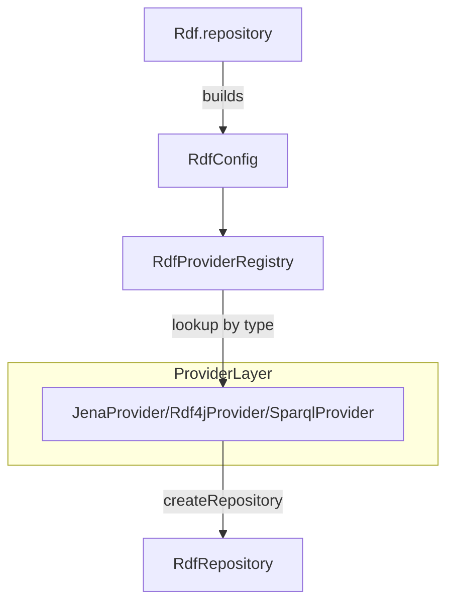

# RDF Provider Design (Internal)

## Purpose
Define how Kastor integrates multiple RDF backends (Jena, RDF4J, SPARQL endpoints, etc.) while supporting different capabilities, and how providers are discovered, selected, and maintained.

## Non-Goals
- Redesigning `RdfConfig` or the DSL.
- Implementing provider-specific features beyond the SPI and registry.
- Changing public API behavior outside provider selection and discovery.

## Architecture Overview
Kastor exposes a unified repository API (`RdfRepository`) and uses an SPI (`RdfApiProvider`) to create repositories for specific backend variants. The registry (`RdfProviderRegistry`) is responsible for discovery, registration, and lookup.

### Component Flow


## Resource Interface Projection (Design)
This section defines how a resource in an RDF graph is projected into a Kotlin interface using a single, clean approach: KSP-generated implementations with live graph access.

### Goals
- Provide a stable, reflection-free API for resource views.
- Support annotated interfaces and SHACL-generated interfaces with the same runtime surface.
- Ensure all accessors read from the live graph by default.
- Keep the implementation independent of a specific RDF backend.

### Core Concepts
- **Resource view**: A generated class that implements the interface with explicit methods.
- **Resource context**: Immutable runtime data used for access: `uri` and `GraphAccess`.
- **Accessor descriptor**: Precomputed metadata for each accessor (predicate path, value type, cardinality, literal constraints).
- **Value codec**: Converts RDF nodes to Kotlin values (scalars, enums, object resources, lists).

### KSP Generation Flow
1. KSP reads annotated interfaces and SHACL-generated interfaces.
2. For each interface, KSP generates:
   - A concrete implementation with explicit accessor methods.
   - Descriptor constants for each accessor.
   - A factory entry to construct the view.
3. Each generated accessor delegates to a single runtime entry point:
   `ResourceAccessor.getValue(context, descriptor)`.

### Proposed Types (Sketch)
```
interface GraphAccess {
    val graph: RdfGraph
    val repository: RdfRepository

    fun <T> read(block: RdfRepository.() -> T): T
}

data class ResourceContext(
    val uri: RdfResource,
    val access: GraphAccess
)

interface ResourceAccessor {
    fun getValue(context: ResourceContext, descriptor: AccessorDescriptor): Any?
}

interface ResourceViewFactory {
    fun <T : Any> createView(
        iface: KClass<T>,
        context: ResourceContext,
        validate: Boolean = false
    ): T
}
```

### Live Graph Access API
All reads go through `GraphAccess`, so accessors always reflect current graph state.
We avoid naming it `Graph` because a graph is already a data structure in the RDF
API; `GraphAccess` makes it clear this is a capability wrapper that exposes the
repository plus a graph handle.

Minimality rationale:
- One entry point (`Resource.as(...)`) for ergonomics.
- One access surface (`GraphAccess`) for live reads.
- One delegation point (`ResourceAccessor.getValue`) for behavior.
This keeps the API surface small while remaining explicit and extensible.

Ergonomic entry point:
```
interface Resource {
    val uri: RdfResource
    val access: GraphAccess

    fun <T : Any> `as`(iface: KClass<T>, validate: Boolean = false): T
}
```
This supports `resource.as(Person::class)` with live access semantics.

### Optional Snapshot Mode (Single Toggle)
If a consistent, point-in-time view is needed, the factory can accept an optional
`ViewOptions` that materializes a local graph once and reuses it for lookups.
Live access remains the default.

### Error Handling
- Missing required values: throw `MissingPropertyException` unless nullable.
- Datatype mismatch: throw `ValueConversionException`.
- Cardinality violations: throw `CardinalityException` with context info.

### Example Delegation Flow
```
val context = ResourceContext(uri, graphAccess)
val person = resourceViewFactory.createView(Person::class, context, validate = false)

// person.name() -> getValue(context, descriptor for "name")
```

### Runtime Selection Path
- `Rdf.repository` builds an `RdfConfig` with `providerId`, `variantId`, and options.
- `RdfProviderRegistry.create(config)` locates a provider/variant:
  - Exact provider/variant match (fast lookup).
  - Requirements-based selection when provided.
- The provider constructs a concrete `RdfRepository`.

## Provider SPI
Providers implement `RdfApiProvider`. The SPI is intentionally minimal, with defaults for optional metadata and capabilities.

Minimal provider requirements:
- `id`: provider id
- `createRepository(config: RdfConfig): RdfRepository`

Optional/override:
- `variants()`: explicit variants (e.g., `memory`, `tdb2`, `native`)
- `getCapabilities()`: opt in to advanced features
- Enhanced methods for service descriptions and detailed capabilities

## Capability Model & Selection Logic
Capabilities are a structured declaration of supported features. Defaults are conservative and require explicit opt-in by providers.

### Capability Sources
- `getCapabilities()` returns the core `ProviderCapabilities`.
- `getDetailedCapabilities()` augments with provider category and feature maps.
- `getProviderCategory()` groups providers by role (store, endpoint, reasoner, validator).

### Capability Categories (Illustrative)
- Storage: persistence, transactions, named graphs, updates
- Query: SPARQL version, property paths, aggregation, sub-select, federation
- Semantics: inference, entailment regimes
- Extensions: RDF-star, custom SPARQL functions
- Service description: supported languages and formats

### Selection Strategies
Selection is typically done by `type` strings, but internal tools can select based on capabilities:
1. Filter by capability requirements (e.g., inference + RDF-star).
2. Prefer local stores for performance when multiple providers match.
3. Prefer remote endpoints when federation or externally managed data is required.

Example selection predicate:
```
requiresTransactions && supportsUpdates && supportsRdfStar
```

## Registry Discovery & Lifecycle
Providers are discovered via `ServiceLoader` and can also be registered programmatically.

Discovery flow:
1. `MemoryRepositoryProvider` is registered explicitly (always present).
2. `ServiceLoader` loads `RdfApiProvider` implementations from:
   `META-INF/services/com.geoknoesis.kastor.rdf.RdfApiProvider`
3. Providers register their supported types for fast lookup.

Registration rules:
- Each provider has a stable `id`.
- `variants()` declares variant ids used in `RdfConfig.variantId`.
- The registry records a `providerId:variantId -> provider` map to avoid linear scans.

## Compatibility & Migration Notes
- Providers should keep existing `providerId` and `variantId` values stable.
- New variants should be additive and explicitly documented.
- Capabilities should be extended conservatively; do not change default semantics.
- When deprecating variants, keep compatibility shims that map old types to new ones.

## Provider Implementation Guidance
- Prefer explicit `getSupportedTypes()` for variant-rich providers.
- Keep `createRepository` strict: throw on unsupported types.
- Only advertise capabilities that are truly supported by the backend.
- Avoid assuming SPARQL 1.2 or service description support without proof.

## Testing Strategy
### Unit Tests
- Registry discovery includes `MemoryRepositoryProvider`.
- `create` resolves providers by supported types and by provider id.
- Capability objects are returned without exceptions for all providers.
- Service description generation returns null or a graph per provider contract.

### Integration Checks
- Smoke-test each backend with a basic graph add/query cycle.
- Validate capabilities align with actual behavior (e.g., transaction support).
- For remote endpoints, validate failure modes and timeouts.

## Appendix: Provider Examples (Pointers)
- Jena: `rdf/jena/src/main/kotlin/.../JenaProvider.kt`
- RDF4J: `rdf/rdf4j/src/main/kotlin/.../Rdf4jProvider.kt`
- SPARQL Endpoint: `rdf/sparql/src/main/kotlin/.../SparqlProvider.kt`


