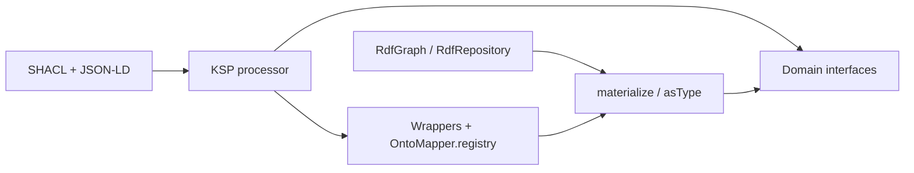

# Kastor Gen Documentation

Welcome to the Kastor Gen documentation. Kastor Gen is the Kotlin code-generation layer for Kastor: it turns SHACL shapes and JSON-LD context into **pure domain interfaces** plus **RDF-backed wrappers**, wired together at runtime by **`OntoMapper`**.

> **Navigate:** tutorials explain workflows; [`reference/`](reference/) is the API source of truth; the [`examples/dcat-us`](../../examples/dcat-us) Gradle module shows DCAT-oriented usage in the build.

## Why Kastor Gen?

### The Problem
Writing domain interfaces manually is:
- ❌ **Time-consuming**: 1-2 hours per complex class
- ❌ **Error-prone**: Typos, wrong IRIs, type mismatches
- ❌ **Hard to maintain**: Must manually sync with ontology changes
- ❌ **Inconsistent**: Code can drift from ontology definitions

### The Solution
Kastor Gen generates type-safe interfaces automatically:
- ✅ **90% faster**: 2 minutes vs 1-2 hours per class
- ✅ **100% consistent**: Code always matches ontology
- ✅ **Type-safe**: Compile-time validation from SHACL constraints
- ✅ **Easy updates**: Regenerate when ontology changes

### Key Benefits

| Benefit | Impact |
|---------|--------|
| **90% less manual code** | Faster development |
| **100% consistency** | Zero sync errors |
| **Compile-time safety** | Fewer runtime bugs |
| **Single source of truth** | Easier maintenance |
| **Pure domain objects** | Clean business code |

[See detailed benefits →](getting-started/benefits.md) | [View comparisons →](getting-started/comparisons.md)

## Table of Contents

- [Getting Started](tutorials/getting-started.md) - Quick start guide
- [Core Concepts](tutorials/core-concepts.md) - Understanding the architecture
- [Domain Modeling](tutorials/domain-modeling.md) - Creating domain interfaces
- [Prefix Mappings](tutorials/prefix-mappings.md) - Using QNames and prefix mappings
- [RDF Integration](tutorials/rdf-integration.md) - Working with RDF side-channels
- [Ontology Generation](tutorials/ontology-generation.md) - Generating code from SHACL/JSON-LD
- [Gradle Configuration](tutorials/gradle-configuration.md) - Gradle-only ontology generation
- [Gradle Plugin Reference](reference/gradle-plugin.md) - Complete Gradle plugin documentation
- [Incremental Builds](guides/incremental-builds.md) - Understanding KSP task inputs/outputs and incremental compilation
- [Serializing Domain Instances](guides/serializing-domain-instances.md) - Serializing generated interface instances to RDF formats
- [API Reference](reference/) - Detailed API documentation
- [Examples](examples/) - Sample applications and use cases
- [Best Practices](best-practices.md) - Guidelines for effective usage
- [FAQ](faq.md) - Frequently asked questions



## What is Kastor Gen?

**Kastor Gen generates type-safe domain interfaces from your SHACL/JSON-LD ontologies, eliminating manual interface writing and ensuring your code always matches your data model.**

Kastor Gen is a Kotlin library that provides:

### 🎯 **Pure Domain Interfaces**
Create clean, RDF-free domain interfaces that represent your business concepts:

```kotlin
// Using full IRIs
@Rdf(iri = "http://www.w3.org/ns/dcat#Catalog")
interface Catalog {
    @Rdf(iri = "http://purl.org/dc/terms/title")
    val title: String
    
    @Rdf(iri = "http://purl.org/dc/terms/description")
    val description: String
    
    @Rdf(iri = "http://www.w3.org/ns/dcat#dataset")
    val dataset: List<Dataset>
}

// Using QNames (recommended): `@file:Rdf(prefixes = …)` then `@Rdf(iri = "prefix:local")`
@file:Rdf(
    prefixes = [
        Prefix("dcat", "http://www.w3.org/ns/dcat#"),
        Prefix("dcterms", "http://purl.org/dc/terms/")
    ]
)

package com.example

import com.geoknoesis.kastor.gen.annotations.Prefix
import com.geoknoesis.kastor.gen.annotations.Rdf

@Rdf(iri = "dcat:Catalog")
interface Catalog {
    @Rdf(iri = "dcterms:title")
    val title: String
    
    @Rdf(iri = "dcterms:description")
    val description: String
    
    @Rdf(iri = "dcat:dataset")
    val dataset: List<Dataset>
}
```

### 🔄 **Automatic Materialization**
Convert RDF nodes to domain objects seamlessly:

```kotlin
val catalog: Catalog = graph.materialize(iri("https://data.example.org/catalog"))

// Pure domain usage
println("Title: ${catalog.title}")
println("Dataset count: ${catalog.dataset.size}")
```

### 🚀 **RDF Side-Channel Access**
Access RDF power when needed without polluting domain interfaces:

```kotlin
// Side-channel access
val rdfHandle = catalog.asRdf()
val extras = rdfHandle.extras

// Access unmapped properties
val altLabels = extras.strings(SKOS.altLabel)
val allPredicates = extras.predicates()

// Validation
rdfHandle.validateOrThrow()
```

### Ontology-driven code generation

Annotate a small **generator** class (or use `@file:Rdf` on the package file) with **`@Rdf(shacl = …, context = …)`**. Paths are under `src/main/resources`. KSP emits interfaces and wrappers into the target package.

```kotlin
import com.geoknoesis.kastor.gen.annotations.Rdf

@Rdf(
    shacl = "ontologies/dcat.shacl.ttl",
    context = "ontologies/dcat.context.jsonld",
    packageName = "com.example.generated",
    generateInterfaces = true,
    generateWrappers = true,
)
class OntologyGenerator
```

## Key Features

### ✅ **Type Safety**
- Compile-time validation of property types
- Automatic mapping from SHACL datatypes to Kotlin types
- Cardinality constraints enforced at the type level
- **Benefit**: 100% type safety, zero runtime type errors

### ✅ **Automatic Generation**
- Generate interfaces from SHACL shapes
- Generate wrappers from JSON-LD context
- Single source of truth (ontology files)
- **Benefit**: 90% less manual code, 100% consistency

### ✅ **Performance**
- Lazy evaluation of properties
- Efficient RDF graph traversal
- Minimal memory footprint
- **Benefit**: No performance overhead vs manual code

### ✅ **Flexibility**
- Pure domain interfaces with optional RDF access
- Support for complex object relationships
- Extensible validation system
- **Benefit**: Clean business code, RDF power when needed

### ✅ **Standards Compliance**
- Full SHACL (Shapes Constraint Language) support
- JSON-LD context integration
- RDF 1.1 specification compliance
- **Benefit**: Industry-standard ontologies work out of the box

## Quick Start

> ⚡ **Quick Benefit**: Instead of spending 1-2 hours writing a domain interface manually, 
> Kastor Gen generates it in 2 minutes from your SHACL ontology. [See how →](getting-started/comparisons.md)

### 1. Add Dependencies

```kotlin
dependencies {
    implementation("com.geoknoesis.kastor:kastor-gen-runtime:0.1.0")
    ksp("com.geoknoesis.kastor:kastor-gen-processor:0.1.0")
}
```

### 2. Define Domain Interface

```kotlin
@Rdf(iri = "http://www.w3.org/ns/dcat#Catalog")
interface Catalog {
    @Rdf(iri = "http://purl.org/dc/terms/title")
    val title: String
    
    @Rdf(iri = "http://www.w3.org/ns/dcat#dataset")
    val dataset: List<Dataset>
}
```

### 3. Use Generated Wrappers

```kotlin
// KSP generates CatalogWrapper automatically
val catalog: Catalog = graph.materialize(iri("https://data.example.org/catalog"))

// Pure domain usage - no RDF dependencies in business code
println("Title: ${catalog.title}")
println("Datasets: ${catalog.dataset.size}")
```

> 🛡️ **Benefit**: Type-safe access with compile-time validation. 
> The `title` property is guaranteed to exist (from SHACL minCount constraint).

### 4. Access RDF Side-Channel

```kotlin
// When you need RDF power
val rdfHandle = catalog.asRdf()
val extras = rdfHandle.extras

// Access unmapped properties
val altLabels = extras.strings(SKOS.altLabel)
val allPredicates = extras.predicates()

// Validate against SHACL
rdfHandle.validateOrThrow()
```

> 🔌 **Benefit**: Clean separation - pure domain interfaces for business logic, 
> RDF side-channel when you need advanced features. Best of both worlds.

## Architecture Overview

```
┌─────────────────┐    ┌──────────────────┐    ┌─────────────────┐
│   Domain        │    │   Kastor Gen     │    │   RDF Graph     │
│   Interfaces    │◄──►│   Runtime        │◄──►│   (Kastor)      │
│                 │    │                  │    │                 │
│ • Pure Kotlin   │    │ • Materialization│    │ • Triples       │
│ • No RDF deps   │    │ • Type mapping   │    │ • SPARQL        │
│ • Business logic│    │ • Validation     │    │ • Serialization │
└─────────────────┘    └──────────────────┘    └─────────────────┘
         │                       │                       │
         │                       │                       │
         ▼                       ▼                       ▼
┌─────────────────┐    ┌──────────────────┐    ┌─────────────────┐
│   Generated     │    │   KSP Processor  │    │   SHACL/JSON-LD │
│   Wrappers      │◄───│                  │◄───│   Ontology      │
│                 │    │ • Code generation│    │   Files         │
│ • RDF-backed    │    │ • Type inference │    │                 │
│ • Lazy loading  │    │ • Validation     │    │ • Shapes        │
│ • Side-channel  │    │ • Registry       │    │ • Context       │
└─────────────────┘    └──────────────────┘    └─────────────────┘
```

## Use Cases

### 📊 **Data Catalogs**
- DCAT (Data Catalog Vocabulary) compliance
- Government open data portals
- Enterprise data governance

### 🏢 **Enterprise Integration**
- RDF-based data lakes
- Semantic web applications
- Knowledge graphs

### 🔬 **Research & Academia**
- Scientific data management
- Research data repositories
- Ontology-driven applications

### 🌐 **Web Applications**
- Linked data publishing
- Semantic search
- Content management systems

## Getting Help

### 📚 **Documentation**
- [Getting Started Guide](tutorials/getting-started.md)
- [Core Concepts](tutorials/core-concepts.md)
- [API Reference](reference/)

### 💬 **Community**
- GitHub Issues for bug reports
- GitHub Discussions for questions
- Stack Overflow with `kastor-gen` tag

### 🛠️ **Examples**
- [DCAT-US Sample](examples/dcat-us/) - Government data catalog
- [FOAF Sample](examples/foaf/) - Friend of a Friend vocabulary
- [Custom Ontology](examples/custom/) - Building your own ontology

## Contributing

We welcome contributions! Please see our [Contributing Guide](CONTRIBUTING.md) for details.

### Development Setup

```bash
git clone https://github.com/geoknoesis/kastor.git
cd kastor
./gradlew build
```

### Running Tests

```bash
./gradlew test
```

### Building Documentation

```bash
./gradlew dokkaHtml
```

## License

Kastor Gen is licensed under the [Apache License 2.0](../../LICENSE).

## Acknowledgments

- Built on top of [Kastor RDF](https://github.com/geoknoesis/kastor)
- Inspired by [Apache Jena](https://jena.apache.org/)
- Compatible with [RDF4J](https://rdf4j.org/)
- Supports [SHACL](https://www.w3.org/TR/shacl/) validation

---

**Ready to get started?** 
- [Getting Started Guide](tutorials/getting-started.md) - Step-by-step tutorial
- [Benefits & Value](getting-started/benefits.md) - Why use Kastor Gen?
- [Manual vs Generated](getting-started/comparisons.md) - See the difference


