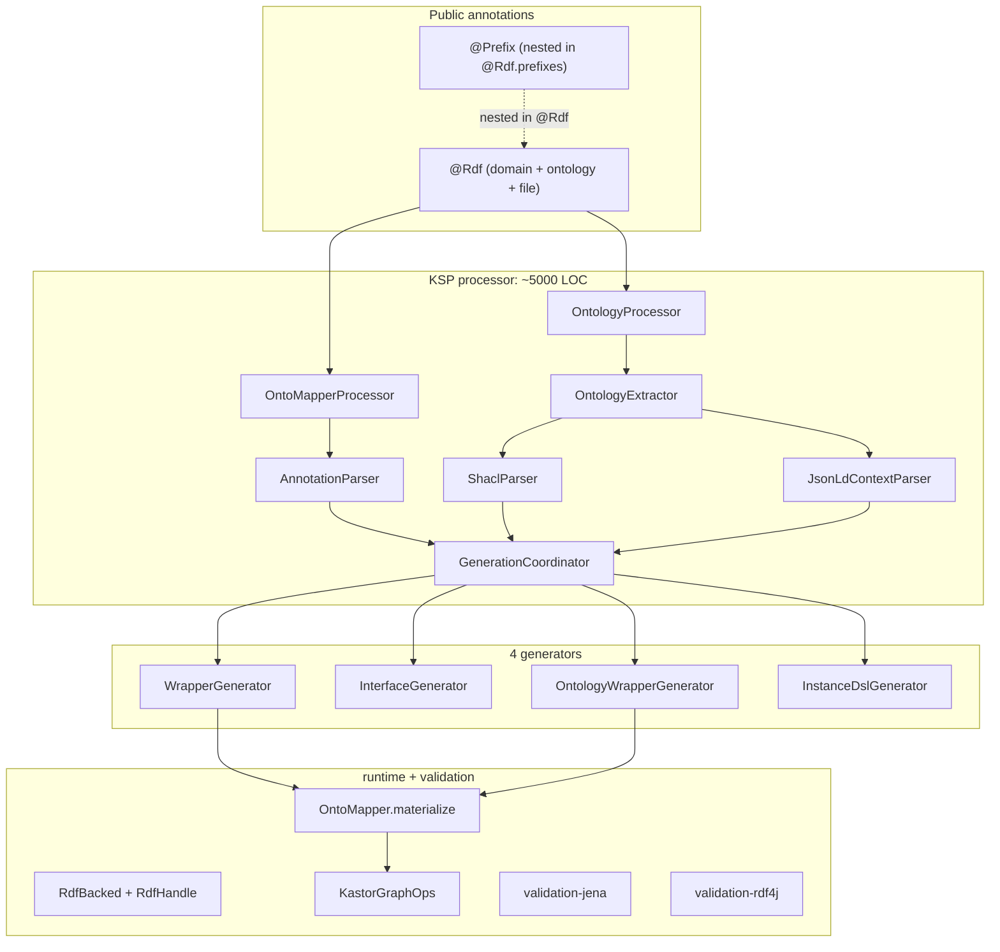
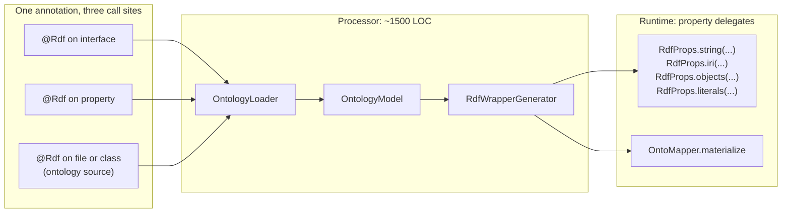
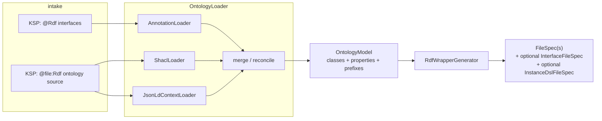

# Lean kastor-gen architecture

This document captured the target design for a leaner `kastor-gen`. The
**unified `@Rdf` annotation**, **delegate-based wrappers**, and **`@file:Rdf(prefixes = …)`**
QName support described here are implemented; larger items (single merged generator,
single intermediate model) may still be open. Treat the remainder as roadmap.

The goal is a redesign that:

- collapses the eight public annotations into **one** (`@Rdf`),
- collapses the four code generators into **one** (`RdfWrapperGenerator`),
- unifies the two parallel pipelines (annotation-driven and ontology-driven)
  through **one** intermediate model (`OntologyModel`),
- moves the runtime contract to **property delegates** so each generated
  wrapper is a few-line shell rather than a hundred-line bespoke class,
- preserves every user-facing capability available today: SHACL-driven
  generation, JSON-LD context support, prefix mappings, validation hooks
  (jena and rdf4j), instance DSL, the Gradle plugin.

## Today's architecture (for context)



Pain points the redesign targets:

- **Two parallel pipelines** for the same goal: annotation-driven
  (`OntoMapperProcessor` + `WrapperGenerator`) and ontology-driven
  (`OntologyProcessor` + `OntologyWrapperGenerator`). They generate slightly
  different output shapes and have substantial duplication
  ([WrapperGenerator.kt](https://github.com/geoknoesis/kastor/blob/main/kastor-gen/processor/src/main/kotlin/com/geoknoesis/kastor/gen/processor/internal/codegen/WrapperGenerator.kt)
  vs
  [OntologyWrapperGenerator.kt](https://github.com/geoknoesis/kastor/blob/main/kastor-gen/processor/src/main/kotlin/com/geoknoesis/kastor/gen/processor/internal/codegen/OntologyWrapperGenerator.kt)).
- **Generators emit large, format-specific code** instead of shelling onto a
  small set of runtime delegates. Every property type (literal, object, list)
  produces a custom `lazy { KastorGraphOps.getXyzValues(...) }` block; the
  generator carries Kotlin-type-to-RDF-type knowledge that should live in the
  runtime.
- **Annotation surface was wide** in older designs (split class/property
  markers and separate ontology markers). The shipped API now centers on
  **`@Rdf`** plus nested **`Prefix`** entries and **`@file:Rdf`** for file-level
  prefix and ontology options; ontology-specific parameters live on the same
  `@Rdf` type where applicable.
- **Two intermediate models**: `ClassModel` (annotation pipeline) and
  `OntologyModel` (ontology pipeline). They diverge slightly even though they
  describe the same thing.

## Target architecture



One annotation, one processor entry point, one model, one generator. The
annotation can describe: a domain interface, a property, or an ontology
source - distinguished by where it sits and which fields are populated.

The runtime gains a property-delegate package
(`com.geoknoesis.kastor.gen.runtime.delegates`). Generated wrappers become
shells like:

```kotlin
internal class CatalogWrapper(input: RdfHandle) : Catalog, RdfBacked {
    override val rdf: RdfHandle = input.scopedTo(KNOWN_PREDS)

    override val title: String        by rdfString(DCTERMS.title)
    override val description: String? by rdfStringOrNull(DCTERMS.description)
    override val datasets: List<Dataset> by rdfObjects(DCAT.dataset)

    private companion object {
        init { OntoMapper.register<Catalog> { CatalogWrapper(it) } }
        val KNOWN_PREDS = setOf(DCTERMS.title, DCTERMS.description, DCAT.dataset)
    }
}
```

Compare to today's hand-coded `lazy { KastorGraphOps.getLiteralValues(...).map { it.lexical }.firstOrNull() ?: "" }` blocks per property.

## Public API: the one-annotation surface

A single `@Rdf` annotation with optional fields. The processor distinguishes
the three roles by call site and which fields are populated.

```kotlin
@Target(
    AnnotationTarget.CLASS,           // interface or class -> domain type
    AnnotationTarget.PROPERTY_GETTER, // property            -> RDF predicate
    AnnotationTarget.FILE,            // file                -> ontology source
)
@Retention(AnnotationRetention.SOURCE)
annotation class Rdf(
    /** IRI or QName naming this domain type / property. */
    val iri: String = "",

    /** Prefix mappings that scope this annotation. */
    val prefixes: Array<Prefix> = [],

    // -- Ontology-source mode (file-target use only) --
    /** Path to a SHACL shapes file relative to `src/main/resources`. */
    val shacl: String = "",
    /** Path to a JSON-LD `@context` file. */
    val context: String = "",
    /** Target package for generated interfaces; defaults to the annotated file's package. */
    val packageName: String = "",
    /** Whether to generate domain interfaces; default true. */
    val generateInterfaces: Boolean = true,
    /** Whether to generate wrapper implementations; default true. */
    val generateWrappers: Boolean = true,
    /** Whether to generate an instance-DSL builder; default false. */
    val generateDsl: Boolean = false,
    /** DSL name when [generateDsl] is true. Defaults to the lowercase package leaf. */
    val dslName: String = "",
    /** Validation mode for generated wrappers. */
    val validation: Validation = Validation.EMBEDDED,
)

@Target(AnnotationTarget.VALUE_PARAMETER)
@Retention(AnnotationRetention.SOURCE)
annotation class Prefix(val name: String, val namespace: String)

enum class Validation { EMBEDDED, EXTERNAL, NONE }
```

The eight legacy annotations become deprecated `typealias`es and convenience
re-exports (**optional migration shim;** new projects should use `@Rdf` only):

```kotlin
@Deprecated("Use @Rdf", ReplaceWith("Rdf(iri)"))
typealias RdfClass = Rdf

@Deprecated("Use @Rdf", ReplaceWith("Rdf(iri)"))
typealias RdfProperty = Rdf

@Deprecated("Use @Rdf with shacl/context", ReplaceWith("Rdf"))
typealias GenerateFromOntology = Rdf

// ... and so on for OntologyPackage, GenerateInstanceDsl, legacy split annotations
```

Existing user code keeps compiling; new code lands on the unified surface.

### Three usage patterns

```kotlin
// 1) Annotation-driven domain modelling
@Rdf(
  iri = "dcat:Catalog",
  prefixes = [Prefix("dcat", "http://www.w3.org/ns/dcat#"), Prefix("dcterms", "http://purl.org/dc/terms/")],
)
interface Catalog {
  @Rdf(iri = "dcterms:title")
  val title: String

  @Rdf(iri = "dcat:dataset")
  val datasets: List<Dataset>
}
```

```kotlin
// 2) SHACL/JSON-LD-driven generation, file-level
@file:Rdf(
    shacl = "shapes/dcat-us.ttl",
    context = "context/dcat-us.jsonld",
    packageName = "com.example.dcat",
)
package com.example.dcat
```

```kotlin
// 3) Instance DSL, opted in at file level alongside generation
@file:Rdf(
    shacl = "shapes/skos.ttl",
    generateDsl = true,
    dslName = "skos",
)
package com.example.skos
```

## Runtime: property delegates as the backbone

A new `kastor-gen-runtime` package
`com.geoknoesis.kastor.gen.runtime.delegates`:

```kotlin
// Literals
fun rdfString(predicate: Iri): ReadOnlyProperty<RdfBacked, String>
fun rdfStringOrNull(predicate: Iri): ReadOnlyProperty<RdfBacked, String?>
fun rdfStrings(predicate: Iri): ReadOnlyProperty<RdfBacked, List<String>>

fun rdfInt(predicate: Iri): ReadOnlyProperty<RdfBacked, Int>
fun rdfIntOrNull(predicate: Iri): ReadOnlyProperty<RdfBacked, Int?>
fun rdfInts(predicate: Iri): ReadOnlyProperty<RdfBacked, List<Int>>
// ... double, boolean, BigDecimal, LocalDate, Instant, etc.

// Generic typed literal
fun <T : Any> rdfLiteral(
    predicate: Iri,
    decoder: (Literal) -> T,
): ReadOnlyProperty<RdfBacked, T>

// IRIs (raw)
fun rdfIri(predicate: Iri): ReadOnlyProperty<RdfBacked, Iri>
fun rdfIris(predicate: Iri): ReadOnlyProperty<RdfBacked, List<Iri>>

// Object materialization (delegates to OntoMapper)
inline fun <reified T : Any> rdfObject(predicate: Iri): ReadOnlyProperty<RdfBacked, T>
inline fun <reified T : Any> rdfObjectOrNull(predicate: Iri): ReadOnlyProperty<RdfBacked, T?>
inline fun <reified T : Any> rdfObjects(predicate: Iri): ReadOnlyProperty<RdfBacked, List<T>>

// Language-tagged strings (RDF 1.2 directional aware)
fun rdfLangString(predicate: Iri, lang: String): ReadOnlyProperty<RdfBacked, String?>
fun rdfLangStringMap(predicate: Iri): ReadOnlyProperty<RdfBacked, Map<String, String>>
```

Each delegate caches via `lazy(PUBLICATION)` and reads from
`thisRef.rdf.graph` exactly once per property per instance, matching today's
behaviour.

This collapses the 600-line
[PropertyMethodGenerator.kt](https://github.com/geoknoesis/kastor/blob/main/kastor-gen/processor/src/main/kotlin/com/geoknoesis/kastor/gen/processor/internal/codegen/PropertyMethodGenerator.kt)
into a single line per property in the generator output. The Kotlin-type ->
RDF-decoder knowledge moves *into the runtime*, where it belongs and where it
can be unit-tested without firing up KSP.

## Processor pipeline: one model, two intake paths



- **`OntologyLoader`** is a single class with three small private loaders.
  Each produces a partial `OntologyModel` fragment; the loader merges them.
  Annotations override SHACL/JSON-LD where they overlap (so a user can hand-
  tune the generated output).
- **`OntologyModel`** becomes the only intermediate type. Today's `ClassModel`
  + `PropertyModel` move under it; the parallel ontology-side model goes
  away.
- **`RdfWrapperGenerator`** is a single KotlinPoet generator that produces:
  - one `*Wrapper` class per `OntologyModel.classes` (always)
  - one `interface` per class when generation is opted in (file-mode only)
  - one DSL file per class when `generateDsl = true`

  The output uses property delegates from the runtime, so it's mostly
  one line per property:

  ```kotlin
  override val title: String by rdfString(DCTERMS.title)
  ```

## File layout

```
kastor-gen/
  runtime/                              # ~600 LOC (was ~900)
    com/geoknoesis/kastor/gen/runtime/
      RdfBacked.kt                      # interface, unchanged
      RdfHandle.kt                      # interface
      DefaultRdfHandle.kt               # implementation
      Materialization.kt                # OntoMapper, materialize, asType
      delegates/
        Literals.kt                     # rdfString, rdfInt, ...
        Iris.kt                         # rdfIri, rdfIris
        Objects.kt                      # rdfObject<T>, rdfObjects<T>
        LangStrings.kt                  # rdfLangString, rdfLangStringMap
        DelegateBase.kt                 # internal LazyRdfDelegate

  processor/                            # ~1500 LOC (was ~5000)
    com/geoknoesis/kastor/gen/
      annotations/
        Rdf.kt                          # the one annotation + Prefix + Validation
        Legacy.kt                       # typealias deprecation shims
      processor/
        KastorGenProcessor.kt           # KSP entry, ~150 LOC
        OntologyLoader.kt               # ~300 LOC (parses annot + SHACL + JSON-LD)
        OntologyModel.kt                # data classes
        RdfWrapperGenerator.kt          # ~600 LOC (KotlinPoet, single file)
        InstanceDslGenerator.kt         # ~250 LOC, opt-in via Rdf.generateDsl
        Naming.kt                       # IRI -> Kotlin name helpers
        QNameResolver.kt                # unchanged

  gradle-plugin/                        # ~unchanged (~200 LOC)
  validation-jena/                      # ~unchanged
  validation-rdf4j/                     # ~unchanged
```

Net delta: about -3500 LOC in the processor, +600 LOC of runtime delegates,
~zero change in gradle-plugin and validation modules.

## Generated-code shape

For the same user input (a `@Rdf("dcat:Catalog")` interface with `title`,
`description`, `datasets`), the **before/after** diff:

### Before (today's WrapperGenerator output, abridged)

```kotlin
internal class CatalogWrapper private constructor(input: RdfHandle) : Catalog, RdfBacked {
    private val known = setOf(Iri("...#title"), Iri("...#description"), Iri("...#dataset"))
    override val rdf: RdfHandle by lazy(PUBLICATION) {
        if (input is DefaultRdfHandle) DefaultRdfHandle(input.node, input.graph, known) else input
    }
    override val title: String by lazy {
        KastorGraphOps.getLiteralValues(rdf.graph, rdf.node, Iri("...#title"))
            .map { it.lexical }.firstOrNull() ?: ""
    }
    override val description: String by lazy {
        KastorGraphOps.getLiteralValues(rdf.graph, rdf.node, Iri("...#description"))
            .map { it.lexical }.firstOrNull() ?: ""
    }
    override val datasets: List<Dataset> by lazy {
        KastorGraphOps.getObjectValues(rdf.graph, rdf.node, Iri("...#dataset")) { child ->
            OntoMapper.materialize(RdfRef(child, rdf.graph), Dataset::class.java)
        }
    }
    companion object {
        init {
            OntoMapper.registry[Catalog::class.java] = { handle -> CatalogWrapper(handle) }
        }
    }
}
```

### After (lean generator output)

```kotlin
internal class CatalogWrapper(input: RdfHandle) : Catalog, RdfBacked {
    override val rdf: RdfHandle = input.scopedTo(KNOWN)

    override val title: String           by rdfString(DCTERMS.title)
    override val description: String?    by rdfStringOrNull(DCTERMS.description)
    override val datasets: List<Dataset> by rdfObjects(DCAT.dataset)

    private companion object {
        init { OntoMapper.register<Catalog> { CatalogWrapper(it) } }
        val KNOWN = setOf(DCTERMS.title, DCTERMS.description, DCAT.dataset)
    }
}
```

The wrapper is half the size, far easier to read, and every line of "what
this property does" lives in the runtime where it can be tested directly.

## Migration path

The redesign keeps the existing public API working through deprecation
shims, so end users can migrate at their own pace.

| Step | What the user does | Impact |
|------|--------------------|--------|
| 0 | Bump to current `kastor-gen` | Prefer `@Rdf` everywhere; older docs may still mention split annotations. |
| 1 | Use `@Rdf(iri = …)` on types and properties; add `@file:Rdf(prefixes = …)` or `prefixes = […]` for QNames | Source-only. |
| 2 | Replace `@GenerateFromOntology` on a class with `@file:Rdf(shacl = ..., context = ...)` on the package file | Source-only. |
| 3 | (Optional) Replace any custom `*Wrapper` you wrote against the legacy generators with the new wrapper output | Generally automatic; the generated wrappers are output-compatible apart from the smaller bytecode footprint. |

`kastor-gen 0.4.0` removes the deprecated typealiases.

## Implementation milestones

A staged rollout that keeps the build green at every step. Each is
independently shippable.

1. **Runtime delegates** (~1 day). Add the `delegates/` package, a unit-test
   suite that runs them against an in-memory graph. No processor changes
   yet. Today's generator output keeps working unchanged.
2. **`@Rdf` annotation + deprecation shims** (~half day). Add the new
   annotation, type-alias the old ones, update the docs. Processor still
   reads the legacy annotations under the hood (since the aliases share the
   same KClass).
3. **Unified `OntologyModel`** (~1 day). Collapse `ClassModel` and the
   ontology-side model into one. Adapt the existing two pipelines to emit
   the new model. No generator changes yet.
4. **`RdfWrapperGenerator`** (~2 days). New single generator that consumes
   the unified model and emits delegate-based wrappers. Add it side by side
   with the legacy generators behind a system property
   (`-Dkastor.gen.lean=true`).
5. **Cut over** (~half day). Switch the processor to call the new generator
   by default; remove the legacy generators; update tests.
6. **Polish** (~1 day). Inline naming/QName helpers, remove dead code in
   `processor/api/extensions/`, update `samples/` and `examples/` to use
   `@Rdf`.

Total: ~6 working days. Each milestone is gated on `./gradlew test` staying
green.

## Test strategy

The current test suite has good coverage of generator output through
`OntoMapperProcessorTest`, `OntologyProcessorIntegrationTest`,
`InstanceDslIntegrationTest`, etc. Strategy:

- **Keep all current tests passing** end-to-end. The generated wrapper
  shape changes, but `MaterializationTest` /
  `OntologyProcessorIntegrationTest` only assert behaviour (a wrapper
  produces correct values from a graph), not structure.
- **Add `delegates/` unit tests** for each `rdfString`, `rdfInt`, ... helper,
  covering: present value, absent value, multiple values, type coercion,
  blank-node handling, RDF 1.2 directional language string fallback.
- **Add a `LegacyAnnotationCompatibilityTest`** (if shims exist) that pins the
  deprecation story: fixtures using only `@Rdf` must match current generator
  output.
- **Add a `WrapperOutputGoldenTest`** that snapshots a small set of
  representative wrappers (catalog, dataset, person) so we catch
  unintended generator changes.

## Out of scope

These would each warrant their own design and aren't covered here:

- A Kotlin compiler plugin replacement for KSP (the user picked `ksp_lean`,
  not `compiler_plugin`).
- Auto-generation of mutation helpers (today's wrappers are read-only).
- A pluggable codec system that lets users register custom literal decoders
  globally rather than per-property.
- Replacing the JSON-LD context parser with a full JSON-LD 1.2 processor.

## Open questions

1. **Should `@Rdf(iri = "")` on an interface be allowed**, with the IRI
   inferred from the interface's package + simple name? It would simplify
   day-zero usage but introduces magic. Recommend: yes for `@Rdf` on a
   property (use property-name fallback), no for `@Rdf` on a class (require
   an explicit IRI).
2. **Where do shared prefixes live?** Two options: `@Rdf(prefixes = [Prefix(...)])` on the same target as the
   `@Rdf(iri = "...")` declaration (current option in this doc), or a
   separate file-level `@Rdf(prefixes = ...)` that scopes everything in the
   file. Recommend: support both; prefixes on the same annotation override
   file-level prefixes.
3. **`generate-only-this-class` knob**: the legacy `generateInterfaces` /
   `generateWrappers` toggles let users opt out of one half of the output.
   Keep them as named arguments on `@file:Rdf` (current proposal), or drop
   them and require the user to delete the generated source they don't want?
   Recommend: keep, since it's an existing feature that some samples rely
   on.

These are flagged for the implementation phase rather than blocking sign-off
on the architecture.
