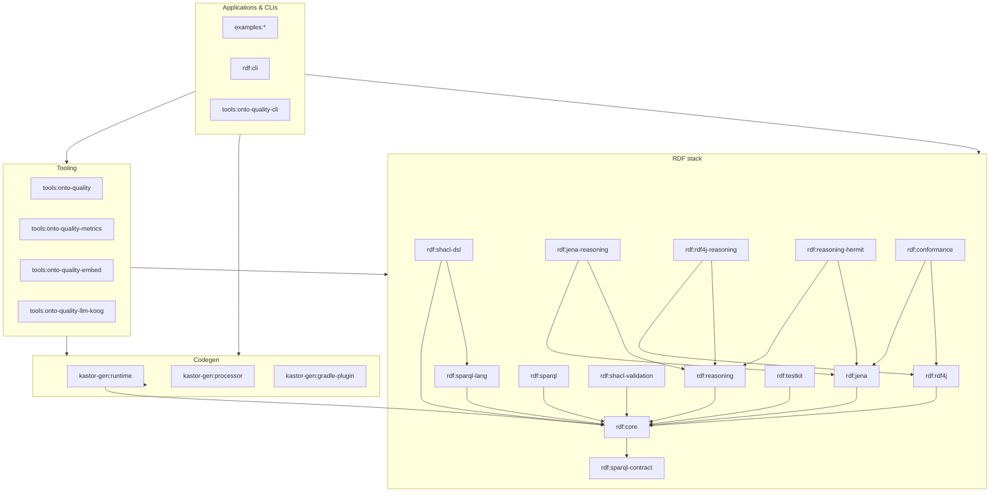

# Repository architecture

This page maps the **Kastor monorepo** Gradle modules so you can find code quickly and avoid circular assumptions when contributing.

## Layers (dependency direction)

Higher layers depend on lower ones; **`rdf:core`** stays provider-agnostic.

Exact dependency edges differ per module; the diagram shows **typical** vertical relationships.

## Adapter modules and classpath shape

**Stores vs reasoning SPI**

- **`rdf:jena`** and **`rdf:rdf4j`** focus on **repository / graph adapters** and **`RdfProvider`** wiring. They **do not** depend on **`rdf:reasoning`** so embedders avoid pulling the reasoning API and its graph unless they opt in.
- Optional **`com.geoknoesis.kastor.rdf.reasoning.RdfReasonerProvider`** implementations ship in **`rdf:jena-reasoning`** (Jena rule engines) and **`rdf:rdf4j-reasoning`** (RDF4J-oriented stub reasoner). Add one or both when you need **`ReasonerRegistry`** discovery or direct **`JenaReasonerProvider`** / **`Rdf4jReasonerProvider`** types.

**RDF4J “fat” stack**

- **`rdf:rdf4j`** still bundles **native SHACL Sail variants** and **`rdf:shacl-validation`** integration—narrowing that further would require splitting repository variants into separate published artifacts (future work).

## Dependency profiles (Gradle)

Typical combinations (coordinates use the Kastor BOM or matching versions):

| Goal | Gradle modules / artifacts |
|------|---------------------------|
| **Minimal store + Kastor API** | `rdf:core` + `rdf:jena` *or* `rdf:rdf4j` |
| **+ SPARQL query DSL / `select {}`** | add **`rdf:sparql-lang`** (**`api`** **`rdf:core`**). |
| **+ SHACL shapes DSL (`shacl {}`, `Rdf.shacl`)** | add **`rdf:shacl-dsl`** (Maven **`rdf-shacl-dsl`**); **`api`** **`sparql-lang`** for embedded SPARQL constraints — you usually **do not** add **`sparql-lang`** separately. |
| **+ SHACL validation APIs** | add `rdf:shacl-validation` (often already transitive from RDF4J adapter when using SHACL sails) |
| **+ Reasoning facade (`RdfReasoning`, SPI)** | add `rdf:reasoning` + **`rdf:jena-reasoning`** and/or **`rdf:rdf4j-reasoning`** |
| **Batteries included** | use **`kastor-bom`** — pins **`jena-reasoning`** and **`rdf4j-reasoning`** alongside core adapters |

**Migration note:** releases after this split no longer pull **`rdf:reasoning`** transitively through **`rdf:jena`** or **`rdf:rdf4j`**. Applications that called **`JenaReasonerProvider`** or relied on SPI discovery of Jena/RDF4J reasoners must add **`com.geoknoesis.kastor:jena-reasoning`** / **`com.geoknoesis.kastor:rdf4j-reasoning`** explicitly (or stay on the BOM).

## Modularity roadmap (`rdf:core`)

**Implemented:** **`rdf:sparql-contract`** holds **SPARQL query marker types** (`SparqlSelect`, `SparqlSelectQuery`, `UpdateQuery`, …) with **no** dependency on the rest of the stack. **`rdf:core`** depends on it with **`api`**, so ordinary **`rdf:core`** consumers still compile **`repository.select(SparqlSelectQuery("…"))`** without extra coordinates.

**Implemented:** **`rdf:sparql-lang`** holds **`com.geoknoesis.kastor.rdf.sparql`** (AST, renderer, **`select {}`** DSL, flows). It **`api`**-depends on **`rdf:core`**.

**Implemented:** **`rdf:shacl-dsl`** holds **`ShaclDsl`**, top-level **`shacl {}`**, and **`Rdf.shacl`**. It **`api`**-depends on **`rdf:core`** and **`rdf:sparql-lang`**. **`rdf:shacl-validation`** stays independent (validators consume RDF graphs only).

There is **no** Gradle cycle among **`core`**, **`sparql-contract`**, **`sparql-lang`**, and **`shacl-dsl`**.

Embedders that only pass **string** SPARQL through **`SparqlQueryable`** need **`rdf-core`** (which pulls **`rdf-sparql-contract`** on Maven). Code under **`com.geoknoesis.kastor.rdf.sparql.*`** or **`addCommonPrefixes`** needs **`sparql-lang`**. Kotlin **`shacl {}`** / **`Rdf.shacl`** needs **`shacl-dsl`** (which pulls **`sparql-lang`** transitively).

**`rdf:sparql`** (remote SPARQL endpoint repository) depends only on **`rdf:core`** and HTTP client libraries—no Jena/RDF4J requirement for compilation.

**`rdf:testkit`** uses Jena internally for sorted N-Triples snapshots; Jena is an **`implementation`** dependency so callers of test helpers are not forced onto Jena’s compile classpath unless they touch Jena APIs themselves.

## Dependency hygiene (automated)

The root build applies the [**Dependency Analysis Gradle plugin**](https://github.com/autonomousapps/dependency-analysis-android-gradle-plugin) (`com.autonomousapps.dependency-analysis`) to production library modules (not the BOM, `:benchmarks:*`, or `:examples:*`, which keeps `buildHealth` fast enough for CI). Run **`./gradlew buildHealth`** to generate holistic dependency advice; CI runs the same task.

## Module groups

| Prefix | Role |
|--------|------|
| **`bom`** | Maven BOM — pins compatible versions for published artifacts. |
| **`rdf:sparql-contract`** | Tiny API: SPARQL query marker types (`SparqlSelectQuery`, `UpdateQuery`, …). Maven **`artifactId`**: **`rdf-sparql-contract`**. |
| **`rdf:core`** | Portable RDF API, graph/RDF DSL, providers SPI; **`api`** **`:rdf:sparql-contract`**; no Jena/RDF4J in **`api`**. Maven **`artifactId`**: **`rdf-core`**. |
| **`rdf:sparql-lang`** | SPARQL AST/renderer/`select {}` DSL, binding flows; **`api`** **`:rdf:core`**. Maven **`artifactId`**: **`sparql-lang`**. |
| **`rdf:shacl-dsl`** | SHACL shapes DSL (**`shacl {}`**, **`Rdf.shacl`**); **`api`** **`:rdf:core`**, **`api`** **`:rdf:sparql-lang`**. Maven **`artifactId`**: **`rdf-shacl-dsl`**. |
| **`rdf:jena`**, **`rdf:rdf4j`** | Backend adapters and repositories (no **`rdf:reasoning`** transitively). Maven **`artifactId`**: **`rdf-jena`**, **`rdf-rdf4j`**. |
| **`rdf:jena-reasoning`**, **`rdf:rdf4j-reasoning`** | Optional **`RdfReasonerProvider`** implementations (SPI + direct types). |
| **`rdf:sparql`** | SPARQL execution against endpoints / repositories. Maven **`artifactId`**: **`rdf-sparql`**. |
| **`rdf:reasoning`**, **`rdf:reasoning-hermit`** | Materialization and OWL DL checks used before validation in advanced flows. |
| **`rdf:shacl-validation`** | SHACL engine integration (including native validator paths). Maven **`artifactId`**: **`shacl-validation`**. |
| **`rdf:testkit`** | Test helpers (e.g. isomorphism, golden Turtle). |
| **`rdf:conformance`** | W3C RDF 1.2 syntax harness (Jena + RDF4J); optional submodule for full corpus. |
| **`rdf:cli`** | Small command-line utilities around Kastor RDF. |
| **`kastor-gen:*`** | KSP processors, runtime support, Gradle plugin, validation bridges. |
| **`tools:onto-quality*`** | Ontology quality SHACL catalogues, metrics, embeddings, LLM explanations, CLI. |
| **`examples:*`** | Runnable tutorials and workshop code. |
| **`benchmarks:*`** | SHACL / JMH benchmarking (not part of default `test`). |

## Physical repository layout

Gradle **project paths** (`:rdf:jena`, `:tools:onto-quality`, …) stay stable for `project(":…")` dependencies and **`build/modules/<path>/`** output dirs. On disk, related modules live under **domain folders**; the root [`settings.gradle.kts`](https://github.com/geoknoesis/kastor/blob/main/settings.gradle.kts) assigns `project(...).projectDir` where the default folder would not match.

| Area | On-disk pattern | Gradle projects |
|------|-----------------|-----------------|
| RDF core | [`rdf/core/`](https://github.com/geoknoesis/kastor/tree/main/rdf/core) | `:rdf:core` |
| SPARQL stack | [`rdf/sparql/{contract,lang,endpoint}/`](https://github.com/geoknoesis/kastor/tree/main/rdf/sparql) | `:rdf:sparql-contract`, `:rdf:sparql-lang`, `:rdf:sparql` |
| SHACL | [`rdf/shacl/{validation,dsl}/`](https://github.com/geoknoesis/kastor/tree/main/rdf/shacl) | `:rdf:shacl-validation`, `:rdf:shacl-dsl` |
| Backend adapters | [`rdf/providers/{jena,jena-reasoning,rdf4j,rdf4j-reasoning}/`](https://github.com/geoknoesis/kastor/tree/main/rdf/providers) | `:rdf:jena`, `:rdf:jena-reasoning`, `:rdf:rdf4j`, `:rdf:rdf4j-reasoning` |
| Reasoning | [`rdf/reasoning/{facade,hermit}/`](https://github.com/geoknoesis/kastor/tree/main/rdf/reasoning) | `:rdf:reasoning`, `:rdf:reasoning-hermit` |
| Other RDF modules | `rdf/<name>/` (`cli`, `examples`, `conformance`, `testkit`, …) | same `<name>` |
| Ontology quality | [`tools/onto-quality/{library,cli,metrics,embed,llm-koog}/`](https://github.com/geoknoesis/kastor/tree/main/tools/onto-quality) | `:tools:onto-quality`, … |
| SHACL benchmarks | [`benchmarks/shacl/{jmh,era-cli}/`](https://github.com/geoknoesis/kastor/tree/main/benchmarks/shacl) | `:benchmarks:shacl`, `:benchmarks:shacl-era-cli` |
| Codegen | [`kastor-gen/<module>/`](https://github.com/geoknoesis/kastor/tree/main/kastor-gen) | `:kastor-gen:*` |
| Examples | [`examples/<demo>/`](https://github.com/geoknoesis/kastor/tree/main/examples) | `:examples:*` |

Kotlin **package names** under adapters do **not** use a `providers` segment (for example `com.geoknoesis.kastor.rdf.jena` still lives under [`rdf/providers/jena/src/...`](https://github.com/geoknoesis/kastor/tree/main/rdf/providers/jena)).

## Build commands (orientation)

- **`./gradlew test -x :rdf:conformance:test`** — default multi-module unit/integration tests (see [**CONTRIBUTING**](https://github.com/geoknoesis/kastor/blob/main/CONTRIBUTING.md)).
- **`./gradlew conformanceSmokeTest`** — fast RDF 1.2 harness smoke (`:rdf:conformance`).
- **`./gradlew :rdf:core:test`** — work on the portable core only.

## See also

- [**CONTRIBUTING**](https://github.com/geoknoesis/kastor/blob/main/CONTRIBUTING.md) — full build, CI, and submodule notes.
- [**RDF 1.2 conformance testing**](rdf-1.2-conformance.md) — harness layout and commands.
