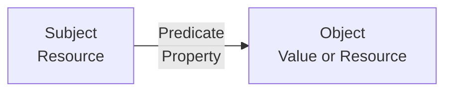
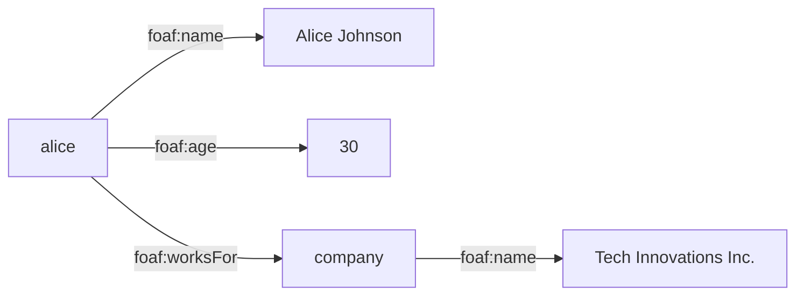

# 📖 RDF Fundamentals



Understanding the basics of RDF (Resource Description Framework) is essential for working effectively with Kastor RDF. This guide covers the core concepts you need to know.

## 📋 Table of Contents

- [What is RDF?](#-what-is-rdf)
- [Core Concepts](#-core-concepts)
- [RDF Triples](#-rdf-triples)
- [RDF Terms](#-rdf-terms)
- [Named Graphs](#-named-graphs)
- [RDF Vocabularies](#-rdf-vocabularies)
- [SPARQL Basics](#-sparql-basics)
- [RDF Serialization Formats](#-rdf-serialization-formats)
- [Best Practices](#-best-practices)

## 🎯 What is RDF?

**RDF (Resource Description Framework)** is a standard model for data interchange on the web. It provides a way to describe resources (things) and their relationships in a structured format.

### 🌟 Key Characteristics

- **Graph-based**: Data is represented as a directed graph
- **Web-native**: Designed for the World Wide Web
- **Extensible**: Can represent any type of information
- **Interoperable**: Standards-based for data sharing
- **Semantic**: Captures meaning, not just syntax

### 🎯 Why Use RDF?

- **Data Integration**: Combine data from different sources
- **Semantic Search**: Find information based on meaning
- **Knowledge Representation**: Model complex relationships
- **Linked Data**: Connect related information across the web
- **Inference**: Automatically derive new information

## 🔧 Core Concepts

### Resources

A **resource** is anything that can be identified on the web. Resources are identified by URIs (Uniform Resource Identifiers).

```kotlin
// Examples of resources
val person = iri("http://example.org/person/alice")
val company = iri("http://example.org/company/tech")
val document = iri("http://example.org/document/1")
```

### Properties

A **property** describes a relationship between resources or between a resource and a value.

```kotlin
// Examples of properties
val name = iri("http://example.org/person/name")
val age = iri("http://example.org/person/age")
val worksFor = iri("http://example.org/person/worksFor")
```

### Values

A **value** can be:
- **Literal**: Text, numbers, dates, etc.
- **Resource**: Another resource (creating relationships)

```kotlin
// Literal values
val nameValue = "Alice Johnson"
val ageValue = 30
val emailValue = "alice@example.com"

// Resource values
val companyValue = iri("http://example.org/company/tech")
```

## 🔗 RDF Triples

The fundamental unit of RDF is the **triple**, which consists of three parts:

1. **Subject**: The resource being described
2. **Predicate**: The property or relationship
3. **Object**: The value or target resource

### 📝 Triple Structure

```
Subject → Predicate → Object
```



### 🎯 Examples

```kotlin
// Triple: Alice has name "Alice Johnson"
val alice = iri("http://example.org/person/alice")
val name = iri("http://example.org/person/name")
val aliceName = "Alice Johnson"

// Creating the triple
val triple = RdfTriple(alice, name, string(aliceName))

// Using Kastor RDF DSL
repo.add {
    alice[name] = "Alice Johnson"
    // or
    alice has name with "Alice Johnson"
    // or
    alice has name with "Alice Johnson"
}
```

### 🧭 Graph View



### 🔄 Multiple Triples

A single resource can have multiple properties:

```kotlin
repo.add {
    val alice = iri("http://example.org/person/alice")
    val company = iri("http://example.org/company/tech")
    
    // Multiple triples about Alice
    alice["http://example.org/person/name"] = "Alice Johnson"
    alice["http://example.org/person/age"] = 30
    alice["http://example.org/person/email"] = "alice@example.com"
    alice["http://example.org/person/worksFor"] = company
    
    // Information about the company
    company["http://example.org/company/name"] = "Tech Innovations Inc."
    company["http://example.org/company/industry"] = "Software Development"
}
```

## 🏷️ RDF Terms

RDF uses specific terms to represent different types of data:

### IRI (Internationalized Resource Identifier)

An IRI is a generalization of URI that can contain Unicode characters.

```kotlin
// Creating IRIs
val personIri = iri("http://example.org/person/alice")
val nameIri = iri("http://example.org/person/name")

// Using in triples
repo.add {
    val alice = personIri
    alice[nameIri] = "Alice Johnson"
}
```

### Literals

Literals represent values like text, numbers, dates, etc.

```kotlin
// String literals
val name = string("Alice Johnson")
val email = string("alice@example.com")

// Numeric literals
val age = int(30)
val salary = 75000.0.toLiteral()

// Boolean literals
val active = boolean(true)

// Date literals
val birthDate = string("1993-05-15")
```

### Resources

Resources are identified by IRIs and can be subjects or objects in triples.

```kotlin
// Creating resources
val alice = iri("http://example.org/person/alice")
val bob = iri("http://example.org/person/bob")
val company = iri("http://example.org/company/tech")

// Using resources in relationships
repo.add {
    alice["http://example.org/person/friend"] = bob
    alice["http://example.org/person/worksFor"] = company
}
```

## 📊 Named Graphs

RDF supports **named graphs**, which allow you to group related triples together.

### 🎯 What are Named Graphs?

A named graph is a collection of triples identified by an IRI. It's like a "container" for related data.

```kotlin
// Create a named graph
val metadataGraph = repo.createGraph(iri("http://example.org/graphs/metadata"))

// Add triples to the named graph
repo.addToGraph(iri("http://example.org/graphs/metadata")) {
    val metadata = iri("http://example.org/metadata")
    metadata["http://example.org/metadata/created"] = "2024-01-01"
    metadata["http://example.org/metadata/version"] = "1.0"
    metadata["http://example.org/metadata/description"] = "Sample dataset"
}

// List all named graphs
val graphs = repo.listGraphs()
println("Named graphs: $graphs")
```

### 🎯 Use Cases for Named Graphs

- **Data Provenance**: Track where data came from
- **Access Control**: Different permissions for different graphs
- **Data Organization**: Group related information
- **Versioning**: Different versions of the same data

## 📚 RDF Vocabularies

RDF vocabularies define sets of terms (properties and classes) for specific domains.

### 🎯 What are Vocabularies?

A vocabulary is a collection of IRIs that represent concepts in a specific domain.

```kotlin
// Example: FOAF (Friend of a Friend) vocabulary
object Foaf {
    val Person = iri("http://xmlns.com/foaf/0.1/Person")
    val name = iri("http://xmlns.com/foaf/0.1/name")
    val age = iri("http://xmlns.com/foaf/0.1/age")
    val email = iri("http://xmlns.com/foaf/0.1/mbox")
    val knows = iri("http://xmlns.com/foaf/0.1/knows")
}

// Using the vocabulary
repo.add {
    val alice = iri("http://example.org/person/alice")
    
    alice[Foaf.name] = "Alice Johnson"
    alice[Foaf.age] = 30
    alice[Foaf.email] = "alice@example.com"
}
```

### 🎯 Common Vocabularies

- **FOAF**: Friend of a Friend (people and relationships)
- **Dublin Core**: Metadata for resources
- **RDFS**: RDF Schema (basic modeling)
- **OWL**: Web Ontology Language (advanced modeling)
- **SKOS**: Simple Knowledge Organization System (thesauri)

## 🔍 SPARQL Basics

SPARQL is the query language for RDF data.

### 🎯 What is SPARQL?

SPARQL (SPARQL Protocol and RDF Query Language) is a standardized query language for RDF data.

### 📝 Basic Query Structure

```sparql
SELECT ?variable1 ?variable2
WHERE {
    ?subject ?predicate ?object .
    ?subject ?predicate2 ?variable1 .
}
```

### 🎯 Query Types

#### SELECT Queries

Retrieve data from the repository:

```kotlin
val results = repo.select(SparqlSelectQuery("""
    SELECT ?name ?age ?email
    WHERE {
        ?person <http://example.org/person/name> ?name ;
                <http://example.org/person/age> ?age ;
                <http://example.org/person/email> ?email .
    }
"""))

results.forEach { binding ->
    val name = binding.getString("name")
    val age = binding.getInt("age")
    val email = binding.getString("email")
    println("$name (age $age): $email")
}
```

#### ASK Queries

Check if data exists:

```kotlin
val exists = repo.ask(SparqlAskQuery("""
    ASK {
        ?person <http://example.org/person/name> "Alice Johnson" .
    }
""")))
println("Alice exists: $exists")
```

#### CONSTRUCT Queries

Create new triples from existing data:

```kotlin
val newTriples = repo.construct(SparqlConstructQuery("""
    CONSTRUCT {
        ?person <http://example.org/person/fullName> ?name .
    }
    WHERE {
        ?person <http://example.org/person/name> ?name .
    }
""")))
```

### 🎯 SPARQL Patterns

#### Basic Triple Patterns

```sparql
?person <http://example.org/person/name> ?name .
```

#### Multiple Patterns

```sparql
?person <http://example.org/person/name> ?name ;
        <http://example.org/person/age> ?age ;
        <http://example.org/person/email> ?email .
```

#### Optional Patterns

```sparql
?person <http://example.org/person/name> ?name .
OPTIONAL { ?person <http://example.org/person/phone> ?phone . }
```

#### Filtering

```sparql
?person <http://example.org/person/name> ?name ;
        <http://example.org/person/age> ?age .
FILTER(?age >= 18)
```

## 📄 RDF Serialization Formats

RDF data can be serialized in different formats:

### 🎯 Common Formats

- **Turtle (.ttl)**: Human-readable, compact
- **RDF/XML**: XML-based, verbose
- **JSON-LD**: JSON-based, web-friendly
- **N-Triples (.nt)**: Simple, one triple per line
- **N-Quads (.nq)**: N-Triples with graph support

### 📝 Example: Turtle Format

```turtle
@prefix person: <http://example.org/person/> .
@prefix company: <http://example.org/company/> .

person:alice
    person:name "Alice Johnson" ;
    person:age 30 ;
    person:email "alice@example.com" ;
    person:worksFor company:tech .

company:tech
    company:name "Tech Innovations Inc." ;
    company:industry "Software Development" .
```

### 📝 Example: JSON-LD Format

```json
{
  "@context": {
    "person": "http://example.org/person/",
    "company": "http://example.org/company/"
  },
  "@id": "person:alice",
  "person:name": "Alice Johnson",
  "person:age": 30,
  "person:email": "alice@example.com",
  "person:worksFor": {
    "@id": "company:tech",
    "company:name": "Tech Innovations Inc.",
    "company:industry": "Software Development"
  }
}
```

## 🚀 Best Practices

### 🎯 Naming Conventions

- **Use descriptive URIs**: `http://example.org/person/name` not `http://example.org/p1`
- **Use consistent prefixes**: Group related terms under the same namespace
- **Use lowercase**: For URIs and property names
- **Use hyphens**: Instead of underscores or camelCase

### 🎯 URI Design

```kotlin
// Good: Descriptive and consistent
object PersonVocab {
    val name = iri("http://example.org/person/name")
    val age = iri("http://example.org/person/age")
    val email = iri("http://example.org/person/email")
    val worksFor = iri("http://example.org/person/worksFor")
}

// Avoid: Generic or inconsistent
object BadVocab {
    val n = iri("http://example.org/p1")
    val a = iri("http://example.org/p2")
    val e = iri("http://example.org/p3")
}
```

### 🎯 Data Modeling

- **Use existing vocabularies**: When possible, reuse standard vocabularies
- **Be specific**: Use precise terms rather than generic ones
- **Consider relationships**: Think about how resources relate to each other
- **Plan for growth**: Design your model to accommodate future changes

### 🎯 Performance Considerations

- **Use appropriate literals**: Choose the right data type for your values
- **Index frequently queried properties**: Consider which properties you'll query often
- **Use batch operations**: For large datasets, use batch operations
- **Monitor performance**: Use the built-in performance monitoring features

## 🎯 Example: Complete RDF Model

Here's a complete example showing RDF fundamentals in practice:

```kotlin
import com.geoknoesis.kastor.rdf.*

fun main() {
    val repo = Rdf.memory()
    
    // Define vocabularies
    object PersonVocab {
        val Person = iri("http://example.org/person/Person")
        val name = iri("http://example.org/person/name")
        val age = iri("http://example.org/person/age")
        val email = iri("http://example.org/person/email")
        val worksFor = iri("http://example.org/person/worksFor")
        val friend = iri("http://example.org/person/friend")
    }
    
    object CompanyVocab {
        val Company = iri("http://example.org/company/Company")
        val name = iri("http://example.org/company/name")
        val industry = iri("http://example.org/company/industry")
        val location = iri("http://example.org/company/location")
    }
    
    // Add data
    repo.add {
        val alice = iri("http://example.org/person/alice")
        val bob = iri("http://example.org/person/bob")
        val company = iri("http://example.org/company/tech")
        
        // Alice's information
        alice[PersonVocab.name] = "Alice Johnson"
        alice[PersonVocab.age] = 30
        alice[PersonVocab.email] = "alice@example.com"
        alice[PersonVocab.worksFor] = company
        alice[PersonVocab.friend] = bob
        
        // Bob's information
        bob[PersonVocab.name] = "Bob Smith"
        bob[PersonVocab.age] = 25
        bob[PersonVocab.email] = "bob@example.com"
        bob[PersonVocab.worksFor] = company
        
        // Company information
        company[CompanyVocab.name] = "Tech Innovations Inc."
        company[CompanyVocab.industry] = "Software Development"
        company[CompanyVocab.location] = "San Francisco"
    }
    
    // Query the data
    val results = repo.select(SparqlSelectQuery("""
        SELECT ?name ?age ?email ?company ?industry
        WHERE {
            ?person <http://example.org/person/name> ?name ;
                    <http://example.org/person/age> ?age ;
                    <http://example.org/person/email> ?email ;
                    <http://example.org/person/worksFor> ?company .
            ?company <http://example.org/company/name> ?companyName ;
                     <http://example.org/company/industry> ?industry .
        }
        ORDER BY ?name
    """))
    
    println("👥 People and their companies:")
    results.forEach { binding ->
        val name = binding.getString("name")
        val age = binding.getInt("age")
        val email = binding.getString("email")
        val company = binding.getString("companyName")
        val industry = binding.getString("industry")
        
        println("  👤 $name (age $age): $email")
        println("     🏢 Works for: $company ($industry)")
    }
    
    // Find friends
    val friends = repo.select(SparqlSelectQuery("""
        SELECT ?name ?friendName
        WHERE {
            ?person <http://example.org/person/name> ?name ;
                    <http://example.org/person/friend> ?friend .
            ?friend <http://example.org/person/name> ?friendName .
        }
    """))
    
    println("\n🤝 Friendships:")
    friends.forEach { binding ->
        val name = binding.getString("name")
        val friendName = binding.getString("friendName")
        println("  $name ↔ $friendName")
    }
    
    repo.close()
}
```

## 🎯 Next Steps

Now that you understand RDF fundamentals, explore:

- **[SPARQL Fundamentals](sparql-fundamentals.md)** - Learn more about querying RDF data
- **[RDF Terms](rdfterms.md)** - Detailed explanation of RDF terms
- **[Vocabularies](vocabularies.md)** - Working with RDF vocabularies
- **[Super Sleek API Guide](super-sleek-api-guide.md)** - Advanced Kastor RDF features

## 🤝 Need Help?

- **Documentation**: [docs/](docs/)
- **Examples**: [examples/](examples/)
- **Issues**: [GitHub Issues](https://github.com/geoknoesis/kastor-rdf/issues)
- **Discussions**: [GitHub Discussions](https://github.com/geoknoesis/kastor-rdf/discussions)

---

**🎉 Congratulations! You now have a solid understanding of RDF fundamentals and are ready to build powerful semantic applications with Kastor RDF!**


