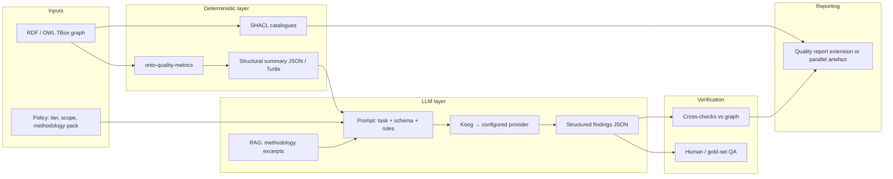

# Design: LLM-assisted ontology modeling review

This note proposes a **hybrid architecture** for surfacing **methodology-driven modeling issues**—for example excessive subclass fan-out, weak identity conditions, or **confusing roles (anti-rigid) with rigid types (sortals)**—using **large language models (LLMs)** together with **deterministic structure** and, where appropriate, **existing onto-quality tiers** (SHACL, embeddings).

It is a **design** only: goals, boundaries, pipeline shape, integration hooks, and risk controls. Implementation can land incrementally in **`:tools:onto-quality-metrics`** (deterministic metrics), `:tools:onto-quality`, `:tools:onto-quality-embed`, and a **Koog**-backed LLM layer (see §4.1) rather than custom per-vendor HTTP plugins.

---

## 1. Goals and non-goals

### Goals

- Flag **modeling smells** that are **expensive or awkward** to encode purely in SHACL: cognitive overload from wide taxonomies, dubious subclassing of roles or phases, missing or overloaded identity criteria, domain vocabulary stretched beyond its discipline, etc.
- Ground suggestions in **documented methodology** (OntoClean and related identity/rigidity notions, UML-style role modeling discipline, FAIR vocabulary practice, team style guides) so outputs are **explainable** and **auditable**.
- Produce findings that **compose** with [Ontology Quality](../features/ontology-quality.md): same CI mental model (report, severity, optional gating) without pretending LLM output is entailment.

### Non-goals

- Replace OWL reasoning, SHACL, or OOPS!-style structural checks.
- Guarantee soundness: LLM suggestions are **heuristic** and must be labeled as such.
- Fully automate ontology repair without human review on high-impact changes.

---

## 2. Why an LLM layer (and why not “SHACL only”)

| Signal | Typical SHACL / graph pattern | LLM-friendly signal |
|--------|------------------------------|----------------------|
| “Too many subclasses” | Possible via **counts** + thresholds (fragile, domain-specific) | Natural-language **taxonomy digest** + methodology rules (“prefer composition / roles when fan-out is organizational”) |
| Role vs rigid class | Rarely decidable from syntax alone; needs **meta-level** interpretation of labels and intent | Short **definitions + labels** in context of parent classes |
| Confusing sortal / phase / role (OntoClean family) | Almost never SHACL-Core without a commitment to meta-properties | Explicit checklist in prompt + **RAG** from methodology text |
| “This looks like a database schema pasted as classes” | Some heuristics (naming, property duplication) | Holistic **narrative** over module purpose and naming story |

**Principle:** Use **deterministic metrics and SHACL** to *narrow scope* and *verify easy contradictions*; use the LLM to *rank and explain* methodology issues inside that scope.

---

## 3. Modeling issue taxonomy (initial)

The classifier should start small and versioned (e.g. `oqsh:llmIssueType` or a JSON enum), for example:

1. **Taxonomy scale** — unusually high direct subclass count under one class; shallow but extremely broad trees; duplicate “sibling” concepts with near-identical labels.
2. **Rigidity / identity** — candidate **role** or **phase** modeled as **rigid** type (classic OntoClean class of errors); identity criteria missing for “sortal-like” class names.
3. **Subclass vs association** — relationship reified as class hierarchy where an object or association would match methodology better (without mandating a single upper ontology).
4. **Mixed abstraction levels** — siblings at incompatible granularity (physical object vs process vs document under one parent without intermediate typing discipline).
5. **Vocabulary / commitment** — labels contradict text definitions; multilingual clash; terms that suggest a **closed operational schema** (e.g. codes, statuses) attached as **open-world** TBox without documentation.
6. **Module cohesion** — disjoint concerns merged into one namespace; ambiguous “misc” buckets (conceptually related to “junk drawer” pitfalls but judged holistically).
7. **SKOS sibling orthogonality** — at a given **hierarchical level** (same direct `skos:broader`, or same “tier” in a balanced tree), **sibling concepts** should differentiate along **compatible, non-overlapping axes**—not mix criteria (e.g. process vs product vs role under one parent), **subsume** each other notionally, or **duplicate facets** under different labels. True orthogonality is **interpretive**; structure and similarity supply **signals**, not proofs.

Each type maps to **methodology snippets** in retrieval (see §6) and to **severity hints** (typically Warning / Info unless combined with hard structural violations).

---

## 4. Architecture overview

**Flow:**

1. **Ingest** the ontology (and optional imports closure policy—same pitfall family as [SHACL QC design pitfalls](shacl-quality-control-pitfalls.md) §QC-02).
2. **Structural pass:** run existing **SHACL** bundles; run **`:tools:onto-quality-metrics`** (see §7) for asserted-graph statistics that **prioritize LLM capsules** and can be published alone as a **dashboard / CI trend** artefact.
3. **Abstract** a **compact, deterministic representation** for the LLM: per-class/property *capsule* (IRI, labels, comments, local superclass list, outgoing property restrictions summary—not full OWL in XML). **Token budget** enforced; sample or prioritize “hot spots” using **metrics** (e.g. top subclass fan-out, schemes with unusually few labels).
4. **Retrieve** short **methodology** chunks (OntoClean basics, internal style guide, links to public primer sections) into the prompt context.
5. **Generate** **strictly structured** output (JSON Schema): issue type, affected IRIs, short title, explanation, recommended next step, **confidence** (model self-rating or calibrated bucket), **citations** to retrieved chunk IDs.
6. **Verify:** lightweight checks that cited IRIs exist, that the issue type is allowed, and optionally **contradiction rules** (e.g. if SHACL already proved `owl:disjointWith`, downgrade “maybe duplicate” suggestions).

### 4.1 LLM orchestration: Koog (JetBrains)

**Decision:** use **[Koog](https://github.com/JetBrains/koog)** as the **only** LLM runtime integration in Kastor for this pipeline—not a bespoke `ServiceLoader` of HTTP clients per vendor.

**Rationale:**

- Koog already abstracts **multiple providers** (OpenAI, Anthropic, Google, DeepSeek, OpenRouter, Amazon Bedrock, Mistral, Ollama, etc.) with a Kotlin-idiomatic API aligned with **agents**, **structured output**, **tool use**, **streaming**, and **tracing**—capabilities we expect to need as the modeling-review tier grows (RAG in §6, optional multi-step review later).
- Maintaining duplicate adapter code in `:tools:onto-quality` would duplicate Koog’s surface area without adding ontology-specific value.

**Shape in the monorepo:**

- **Thin Kastor façade** (e.g. in `:tools:onto-quality` or a small `:tools:onto-quality-llm` optional module): build **capsules**, attach **methodology context**, enforce **token budgets**, validate **JSON schema** for findings, merge into `ModelingReviewReport` / CLI output.
- **Koog** sits **behind** that façade: configure **model + provider** via Koog’s APIs; supply **API keys and base URLs** from environment / JVM properties (same operational rules as §8). No Kastor-specific vendor plugin SPI.

**Enablement (e.g. onto-quality v0.3):** LLM explanations and modeling review run **only when** configuration provides valid credentials (and an explicit opt-in flag if we keep parity with the embedding tier). If Koog is not on the classpath or keys are missing, the tier **degrades gracefully** (structural + embedding paths unchanged).

**Versioning:** pin Koog to a **tested minor**; align **Kotlin / JDK** baselines with Koog’s documented requirements when adding the dependency.

---

## 5. Integration with onto-quality

### Tiering

Introduce a logical tier (name TBD), e.g. **`METHODOLOGICAL`** or reuse **`SEMANTIC`** with a distinct **source** flag. Today `QualityTier` includes `STRUCTURAL`, `SEMANTIC`, `REASONING` in `QualityReport.kt`—adding a tier is an API decision; alternatively keep tier `SEMANTIC` and set **category** to `LLM_CONSUMABILITY` or a new `ONTOLOGY_METHODOLOGY` category for clarity.

### Findings shape

Two viable patterns:

- **A. Native violations:** materialize **SHACL-shaped** “soft” results only if you are willing to mint synthetic `ValidationViolation`-like rows (messy).
- **B. Parallel report (recommended):** `ModelingReviewReport` alongside `QualityReport`, merged at CLI/UI layer with shared severity ordering.

Either way, map rows to:

- **Focus nodes** (class / property IRIs),
- **Methodology reference** (chunk id, optional public URI),
- **Severity** (default Info/Warning),
- **Determinism flag** (`llmGenerated = true`),
- **Prompt/run id** for reproducibility (hashed prompts + model id + temperature).

The codebase already anticipates LLM-related reporting at the category level via `QualityCategory.LLM_CONSUMABILITY`; extending categories for “methodology review” keeps dashboards intuitive.

### Relation to `SemanticEnricher`

- **Embeddings** remain best for **near-duplicate** and **lexical drift** (existing embedding SHACL path).
- **LLM review** addresses **interpretive** issues; optionally feed the LLM **similarity pairs** from `oqsh:semanticallyCloseTo` as extra input (“these pairs are numerically close—are they conceptually distinct?”). For **SKOS**, prioritize **intra-sibling** pairs (concepts sharing the same direct **`skos:broader`**) as evidence for **non-orthogonal** divisions when similarity is high—subject to human or LLM adjudication.

---

## 6. Grounding and RAG

**Without grounding**, models freely hallucinate methodology. Mitigations:

1. **Curated corpus:** short, versioned Markdown or PDF chunks (OntoClean primers, team guidelines, links to stable URLs). For SKOS, add **faceted / orthogonal-sibling** guidance (one partitioning principle per hierarchical level; avoid mixed axes under the same `broader`). Tag chunks with `methodologyId` for citations in output.
2. **Prompt contract:** “Only cite methodology IDs present in context; if unsure, output `issue_type: unknown` and lower confidence.”
3. **Structured output:** JSON Schema validated before accepting a finding; discard or quarantine invalid payloads.
4. **Optional second pass:** smaller/cheaper model **only** checks whether explanation **sentence-level** claims are supported by retrieved chunks (lightweight “attribution” step).

---

## 7. Metrics module (`:tools:onto-quality-metrics`)

The **metrics module** is a separate **Kotlin/JVM library** that computes **deterministic, asserted-graph statistics** over an **`RdfGraph`** from **`:rdf:core`** for **OWL-style TBoxes** and **SKOS vocabularies**. It is not a substitute for SHACL validation or reasoning; it **quantifies structure** so that LLM review (this note), CLIs, and CI can share one implementation.

### 7.1 Responsibilities

| Responsibility | Detail |
|----------------|--------|
| **LLM pre-filter** | Rank “hot” classes, schemes, or branches (fan-out, depth skew) before building capsules; cap cost. |
| **Standalone artefact** | Emit a versioned **report** (Kotlin data + optional JSON/text) for dashboards, diff across releases, or gates (e.g. fail if max fan-out exceeds a team threshold). |
| **Composable** | No dependency on SHACL engines or embeddings; depends only on **`rdf:core`** (single pass over triples). |

### 7.2 Metric families (initial)

Values are **explicit triples only** unless a future phase adds optional reasoning hooks (out of scope for v1).

**Graph-wide**

- Total **triple count**; optional predicate histogram later.

**OWL / general ontology (named IRIs where applicable)**

- Counts: **`owl:Class`** / **`rdfs:Class`**, **`owl:ObjectProperty`**, **`owl:DatatypeProperty`**, **`owl:AnnotationProperty`**, **`owl:Ontology`**.
- **Subclass fan-out:** per parent resource, **direct** `rdfs:subClassOf` children; report **max**, **mean** (over parents with ≥1 child), and **parents at the maximum** (IRI-identified parents when the child set is relevant).
- **Hierarchy depth:** over **named class IRIs** linked by **direct** `rdfs:subClassOf` (IRI–IRI edges only for a first version), with cycle-safe traversal caps—suited for “is this branch oddly deep?” heuristics, not ontological entailment.
- **Imports:** count of `owl:imports` on ontology heads.
- **Subproperty tree (optional later):** same pattern as subclass for `rdfs:subPropertyOf`.

**SKOS**

- Counts: **`skos:Concept`**, **`skos:ConceptScheme`**, **`skos:Collection`** / **`OrderedCollection`**.
- **Documentation coverage:** share of concepts with at least one **`skos:prefLabel`** (and optionally `skos:definition`).
- **Scheme membership:** concepts per **`skos:inScheme`** value; schemes with **`skos:hasTopConcept`** / **`skos:topConceptOf`** usage.
- **Structural edges:** counts of **`skos:broader`**, **`skos:narrower`**, **`skos:related`** (explicit assertions only); mapping predicates (**`exactMatch`**, **`closeMatch`**, …) as separate buckets.
- **Sibling cohorts (structural):** for each **named** concept that appears as a **`skos:broader`** of at least one other concept, compute the set of **direct narrowers** (objects of `skos:broader` pointing at that parent, or symmetrically `skos:narrower` from parent—using **asserted** edges only). Emit **per-parent sibling counts** and optional **pair counts of `skos:related` linking two siblings** (a coarse signal of “lateral” glue where a tree might have conflated dimensions).
- **Orthogonality (methodology, not a single metric):** “**Orthogonal at each level**” means sibling sets under the same parent should partition a **single facet** or **clean coordinate system** at that depth (terminology from faceted classification and knowledge-organization practice). **Neither** SHACL **nor** pure counts can **prove** orthogonality; they only support **spotlighting** cohorts for review. Pairwise **lexical** overlap (shared tokens in `prefLabel`/`altLabel`) can be a cheap **deterministic** flag in metrics; **pairwise embedding similarity among siblings** (from `onto-quality-embed`, scoped to sibling pairs) flags **candidate** overlaps for LLM or curator follow-up.

### 7.3 API sketch

- Entry point: e.g. `VocabularyMetrics.compute(graph: RdfGraph): VocabularyMetricsReport`.
- **`VocabularyMetricsReport`** bundles **graph**, **OWL-oriented**, and **SKOS-oriented** sections (each may be empty or zero-filled when the vocabulary is not used).
- Serializable fields for **automation**; optional **`describeText()`** / **`describeMarkdown()`** for CLI and humans.

### 7.4 Integration points

| Consumer | Use |
|----------|-----|
| **LLM pipeline (§4)** | Hot-spot list + numbers embedded in prompts or capsule ordering. |
| **`onto-qa` (future)** | Optional `metrics` subcommand that prints or writes JSON alongside `check`. |
| **`onto-quality`** | Optional dependency: metrics do not replace `QualityChecker`; they **complement** SHACL findings. |
| **BOM / Maven** | Publish **`com.geoknoesis.kastor:onto-quality-metrics`** next to `onto-quality` when the module ships. |

### 7.5 Non-goals (v1)

- No **SKOS transitive** (`broaderTransitive`) expansion as default.
- No **OWL entailment** or blanket **RL/DL** materialization.
- No **embedding** or string-similarity inside this module (stay in **`onto-quality-embed`**). **Exception (cross-module contract):** reports may include **placeholder fields or companion artefact IDs** for “sibling-pair similarity summaries” produced by the embed pipeline so CLIs can merge **structural sibling cohorts** with **semantic scores** without duplicating embedding logic inside metrics.
- Threshold-based **policy violations** remain optional: the library **measures**; product presets (e.g. “warn if max fan-out > *n*”) can live in CLI or a small policy layer later.

### 7.6 Hot-spot → LLM linkage (table)

| Metric signal | Typical use in capsule prioritization |
|---------------|--------------------------------------|
| High **direct subclass** count under one parent | Taxonomy-scale / “junk drawer” narratives |
| High **depth** under one branch | Mixed abstraction / over-specialization heuristics |
| Low **SKOS prefLabel** coverage | Localization / publishing readiness |
| Many **mapping** edges, few **hierarchical** edges | Alignment-heavy vs taxonomy-light vocabulary |
| Large **SKOS sibling** set under one `broader` + high **embedding** similarity within pairs | **Orthogonality** review (taxonomy: SKOS sibling orthogonality); faceting vs mixed criteria |
| High **`skos:related`** density **within** a sibling cohort | Possible **axis mix** or circular definitions worth an LLM pass |

---

## 8. Security, privacy, and operations

- **Data residency:** TBox may be sensitive; support **local / VPC** models and **no-retention** API policies (including **Ollama** / on-prem via Koog when configured).
- **Secrets:** API keys outside repo; use each provider’s **standard variable names** and Koog’s configuration hooks—do not commit defaults. Align with existing CLI env patterns for a single **`KASTOR_*` opt-in** if useful, but defer to Koog/provider conventions for the actual secret.
- **Logging:** log **hashes** of inputs + methodology pack version, not raw prompts if policy forbids.
- **Cost controls:** caps on classes analyzed per run, batching, caching capsules per ontology **content hash**.

---

## 9. Evaluation

- **Gold set:** small corpus of intentionally flawed vs clean modules (similar spirit to OOPS! calibration in [CALIBRATION.md](../../../tools/onto-quality/CALIBRATION.md)).
- **Metrics:** precision@k on flagged IRIs, methodology citation accuracy, regression tests on prompt/schema versions.
- **Human loop:** required for **Violation**-severity elevation if ever introduced.

---

## 10. Phased roadmap

| Phase | Deliverable |
|-------|-------------|
| **0** | Design freeze: taxonomy, JSON schema, evaluation plan (this doc). |
| **0.5** | **`:tools:onto-quality-metrics`** — MVP report API, OWL + SKOS metric families (§7), unit tests on small Turtle fixtures. |
| **1** | Offline CLI: ontology → capsules + prompt file + stub “model interface”; human runs model externally; **wire metrics report into capsule ordering**. |
| **2** | **Koog**-backed wiring: configure cloud and/or local (e.g. Ollama) providers via Koog; ship `ModelingReviewReport`, merge into `onto-qa` as opt-in subcommand (`review` / `modeling-check` / `explain`); optional **`onto-qa metrics`**. |
| **3** | RAG pack + calibration suite; tie hot-spot metrics to prioritization. |
| **4** | Optional feedback loop: accepted/rejected findings logged to refine prompts and chunk boundaries (privacy permitting). |

---

## 11. Summary

LLM-assisted modeling review **fills a different niche** than SHACL or embedding similarity: it operationalizes **best-practice narratives** over a **compressed structural view** of the TBox. The planned **`:tools:onto-quality-metrics`** module supplies **reproducible numbers** for that view and for CI without entailment. **Koog** supplies **provider-agnostic LLM execution** so Kastor does not maintain parallel HTTP adapters. Success depends on **treating LLM outputs as advisory**, **grounding in methodology text**, **composing with deterministic checks** (SHACL + metrics), and **versioning the methodology pack** alongside shape catalogues—consistent with how Kastor already treats calibration and semantic tiers.

---

## See also

- [onto-quality v0.3 — LLM explanations](onto-quality-v0.3-llm-explanations.md) — **narrow scope:** explain existing `QualityReport` findings only (ships before full modeling-review tier).
- [Koog](https://github.com/JetBrains/koog) — LLM agents and providers (**integration layer for this design**)
- [Ontology Quality](../features/ontology-quality.md)
- [Pitfalls of the SHACL model for quality control](shacl-quality-control-pitfalls.md)
- [Semantic tier](../../../tools/onto-quality/README.md) (`SemanticEnricher`, embedding shapes)
