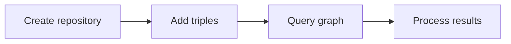

## Getting Started



## Why Kastor (quick comparison)
Kastor is for **domain-first RDF** in Kotlin: work with pure domain interfaces and reach RDF through a side-channel, with a vocabulary-agnostic DSL that keeps semantics explicit.

| Concern | Kastor | Jena / RDF4J / rdflib |
|---|---|---|
| Domain objects without RDF dependencies | ✅ | ❌ |
| Side-channel RDF access | ✅ | ❌ (typically direct RDF types) |
| Vocabulary-agnostic DSL | ✅ | ⚠️ (varies) |
| Provider-agnostic core API | ✅ | ❌ (engine-specific APIs) |

### Requirements
- Kotlin JVM 17
- Gradle with Kotlin plugin

### Install
Add module dependencies based on the provider you want to use. Coordinates inherit the root group and version from the build: `com.geoknoesis.kastor:rdf-*` at version `0.1.0`.

Gradle Kotlin DSL:
```kotlin
dependencies {
  implementation("com.geoknoesis.kastor:rdf-core:0.1.0")
  // Choose one or more providers
  implementation("com.geoknoesis.kastor:rdf-jena:0.1.0")
  implementation("com.geoknoesis.kastor:rdf-rdf4j:0.1.0")
  implementation("com.geoknoesis.kastor:rdf-sparql:0.1.0")
}
```

### First repository
```kotlin
import com.geoknoesis.kastor.rdf.Rdf

val repo = Rdf.memory()
```

### Data flow overview



### Provider discovery
Providers are discovered via Java `ServiceLoader`. If you add a provider dependency, it becomes available to `RdfProviderRegistry` and the factory DSL.

```kotlin
import com.geoknoesis.kastor.rdf.RdfProviderRegistry

val providers = RdfProviderRegistry.discoverProviders() // e.g., [JenaProvider, Rdf4jProvider, SparqlProvider]
```

### Creating RDF Terms

The library provides strongly typed functions for creating RDF terms, especially literals. Short aliases are available for common literal types:

```kotlin
import com.geoknoesis.kastor.rdf.*

// IRIs
val personClass = iri("http://example.org/Person")
val nameProperty = iri("http://example.org/name")

// Blank nodes
val person1 = bnode("person1")

// Literals - strongly typed for better safety (short aliases)
val personName = lang("John Smith", "en")      // Language-tagged literal
val personAge = int(30)                       // Typed literal (xsd:integer)
val personHeight = decimal(175.5)             // Typed literal (xsd:decimal)
val personActive = boolean(true)              // Typed literal (xsd:boolean)
val plainText = string("Some text")           // Plain literal (xsd:string)

// Triples
val triple = triple(person1, nameProperty, personName)

// Or use the natural language DSL
val tripleDsl = person1 has nameProperty with personName
```

### Working with QNames

Use QNames for cleaner, more readable code with prefix mappings:

```kotlin
import com.geoknoesis.kastor.rdf.*

val repo = Rdf.memory()

// Add data using QNames
repo.add {
    // Configure prefix mappings
    prefixes {
        "foaf" to "http://xmlns.com/foaf/0.1/"
        "rdf" to "http://www.w3.org/1999/02/22-rdf-syntax-ns#"
        "dcterms" to "http://purl.org/dc/terms/"
    }
    
    val person = iri("http://example.org/person")
    
    // Use QNames with different syntax styles
    person["a"] = "foaf:Person"                       // Turtle-style "a" alias
    person - "a" - "foaf:Agent"                      // With quotes
    person - a - "foaf:Agent"                        // Without quotes
    person `is` "foaf:Agent"        // Natural language "is" alias
    person - "rdf:type" - "foaf:Person"              // Traditional minus operator
    person["foaf:name"] = "Alice Johnson"             // Bracket syntax
    person has "foaf:age" with 30                     // Natural language
    person has "dcterms:description" with "A person"  // Mixed vocabularies
    
    // Create IRIs from QNames
    val nameIri = qname("foaf:name")
    person - nameIri - "Alice"
    
    // Mix QNames and full IRIs
    person - "foaf:knows" - iri("http://example.org/bob")
    person - "http://example.org/customProp" - "value"
}
```

**Benefits of QNames:**
- **Readability**: Shorter, more readable predicates and types
- **Maintainability**: Change namespace in one place
- **Consistency**: Standard RDF prefix notation
- **Flexibility**: Mix with full IRIs when needed

**Benefits of strongly typed literals:**
- **Type safety**: Prevents invalid combinations (e.g., language + datatype)
- **Clarity**: Intent is explicit in the function name
- **Better IDE support**: Improved autocomplete and documentation
- **Validation**: Constraints enforced at compile time

The old generic `literal()` function is still available for backward compatibility but is deprecated.


