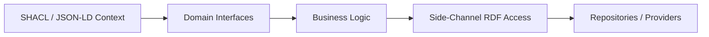

# Design Philosophy

Kastor is built around a clear stance on how developers should work with RDF in Kotlin. This page makes those choices explicit so you can decide if they match your use case.

## Core Beliefs
1. **Domain-first, RDF second**
   - Your application model should stay pure and testable.
   - RDF access belongs in a side-channel, not in your core business types.

2. **Vocabulary-agnostic core**
   - The core API assumes nothing about FOAF, DC, or any other vocabulary.
   - Your vocabularies drive intent; the API stays neutral.

3. **Explicit semantics over magic**
   - Validation and reasoning are explicit, not hidden side effects.
   - The DSL favors clarity over implicit inference.

4. **Provider-agnostic architecture**
   - Jena, RDF4J, Memory, and SPARQL are interchangeable backends.
   - Your app model does not change when storage changes.

## Mental Model
**Think in contracts, not triples.**
- Use SHACL/JSON-LD to define the *shape* of your data.
- Generate or write domain interfaces that reflect those shapes.
- Use the side-channel when you need RDF-level operations.

## What Kastor Is Excellent At
- Domain-driven RDF applications in Kotlin
- Type-safe mapping from SHACL/JSON-LD to Kotlin types
- Cleaner call sites via a vocabulary-agnostic DSL
- Switching backends without rewriting app code

## Intentional Limits (Anti-goals)
- **Not a triple store**: use Jena/RDF4J/other stores for persistence.
- **Not a SPARQL engine**: it integrates with engines provided by backends.
- **Not a full ontology reasoner**: reasoning is delegated to providers.

## How This Differs From Traditional RDF APIs
Traditional RDF libraries typically surface RDF types directly in application code. Kastor separates concerns:
- **Domain code**: pure Kotlin interfaces (no RDF dependencies)
- **RDF power**: accessed through a side-channel when needed

For examples of this approach, see:
- [Kastor Gen Core Concepts](../kastor-gen/tutorials/core-concepts.md)
- [Compact DSL Guide](api/compact-dsl-guide.md)

